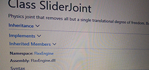

# Flax Engine Documentation

<h3><a href="manual/index.md">Manual</a></h3>

Learn how to create games with Flax Engine!

<h3><a href="api/index.md">C# API</a></h3>

Flax C# scripting API reference.

<h3><a href="api-cpp/index.md">C++ API</a></h3>

Flax C++ scripting API reference.

