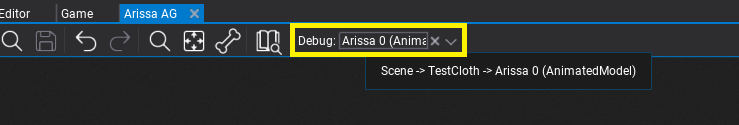
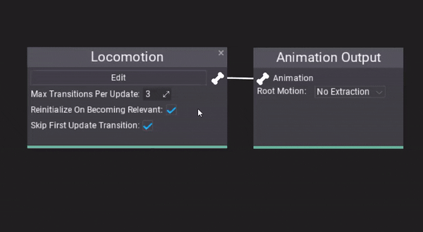
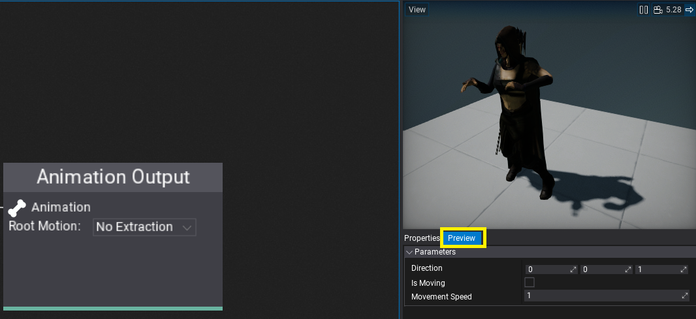

# Anim Graph Debugging

## Animated Model Instance

Use object picker on a toolstrip to debug specific actor from loaded scenes. If unset, the default in-built actor will be used.

## Animation Playback Preview

Anim Graph editor displays the current playback position of the animations as a progress bar over the node. For state machines, the currently sampled states are highlighted with the gree outline.

## Parameters Preview

Under properties panel select **Preview** tab to display current state of animated model parameters. Those can be modified to actively test Anim Graph witohut rebuilding the asset (when changing default parameter values).
