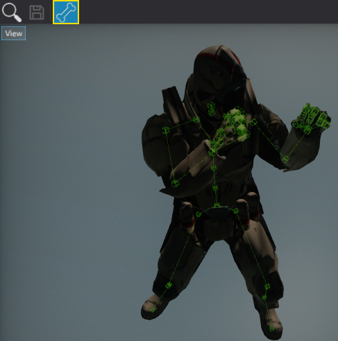

# Skeleton Bones Debugging

Flax Editor features the skeleton bones hierarchy debugging tools.
All the windows that show the animated model including:

* Skinned Model Window
* Anim Graph Window
* Skeleton Mask Window

contain a dedicated button in a toolbar that shows/hides the skeleton bones structure.
Simply check it to see the character bones. It supports live updating so bones will match the animated model movement.
