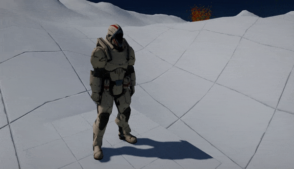

# Animation Slots



Animation Slots are a feature of Anim Graph and Animated Models that allow playing custom animations from code inside the graph. This can be used to play hit-reaction clips or death animation which is controlled directly from the game scripts. Slots support blending in and out animation with custom play-rate speed.

## Anim Graph Setup


To setup slot animation simply add **Animation Slot** node to the Anim Graph or Anim Graph Function and link as a connector at which location the animation should be injected. It can be placed just before final animation output to override the whole pose or you can use custom blending rules to perform more advanced results (eg. animation slot playing only on the upper part of the body with *Blend With Mask* node).

Each slot has its own name but you can reuse the same name in different graph locations or use multiple different slots with your own naming.

## Scripting

**Animated Model** contains scripting API to play/pause/stop animation slots playback and to query the current state. You can play different animations on different slots simultaneously just remember that a single slot can play only one animation at a time. You can also stop all animations playback with `StopSlotAnimation` method.

# [C#](#tab/code-csharp)
```cs
public class AnimationSlotPlayer : Script
{
    public AnimatedModel Model;
    public string AnimSlot = "Default";

    public Animation Anim;
    public float Speed = 1.0f;
    public float BlendInTime = 0.2f;
    public float BlendOutTime = 0.2f;

    /// <inheritdoc />
    public override void OnUpdate()
    {
        if (Input.GetKeyDown(KeyboardKeys.Q))
        {
            Model.PlaySlotAnimation(AnimSlot, Anim, Speed, BlendInTime, BlendOutTime);
        }
        if (Input.GetKeyDown(KeyboardKeys.A))
        {
            Model.StopSlotAnimation(AnimSlot, Anim);
        }
        if (Input.GetKeyDown(KeyboardKeys.Z))
        {
            Model.PauseSlotAnimation(AnimSlot, Anim);
        }
    }
}
```
# [C++](#tab/code-cpp)
```cpp
#include "Engine/Scripting/Script.h"
#include "Engine/Scripting/ScriptingObjectReference.h"
#include "Engine/Level/Actors/AnimatedModel.h"
#include "Engine/Content/AssetReference.h"
#include "Engine/Content/Assets/Animation.h"
#include "Engine/Input/Input.h"

API_CLASS() class GAME_API AnimationSlotPlayer : public Script
{
    API_AUTO_SERIALIZATION(AnimationSlotPlayer);
    DECLARE_SCRIPTING_TYPE(AnimationSlotPlayer);
public:
    API_FIELD() ScriptingObjectReference<AnimatedModel> Model;
    API_FIELD() String AnimSlot = TEXT("Default");

    API_FIELD() AssetReference<Animation> Anim;
    API_FIELD() float Speed = 1.0f;
    API_FIELD() float BlendInTime = 0.2f;
    API_FIELD() float BlendOutTime = 0.2f;

public:

    void OnUpdate() override
    {
        CHECK(Model);
        if (Input::GetKeyDown(KeyboardKeys::Q))
        {
            Model->PlaySlotAnimation(AnimSlot, Anim, Speed, BlendInTime, BlendOutTime);
        }
        if (Input::GetKeyDown(KeyboardKeys::A))
        {
            Model->StopSlotAnimation(AnimSlot, Anim);
        }
        if (Input::GetKeyDown(KeyboardKeys::Z))
        {
            Model->PauseSlotAnimation(AnimSlot, Anim);
        }
    }
};
```
***
