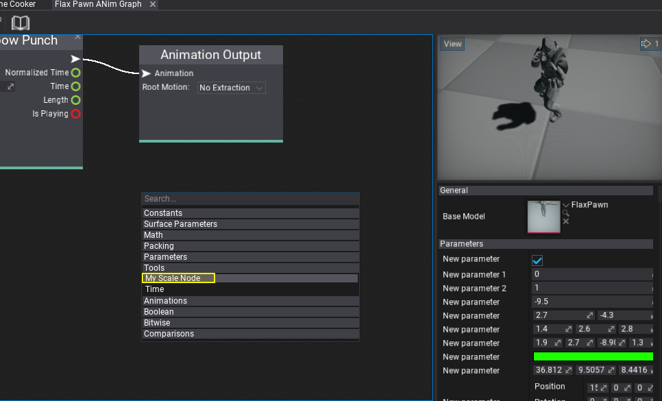
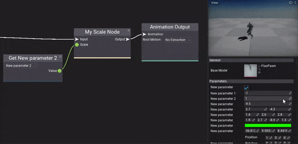

# Anim Graph Custom Nodes

Anim Graph supports extending it by defining and using **custom nodes**. This feature can be used to implement custom IK solver or to perform very specific animation data processing or using custom animation data source such as live-rigging. Follow this documentation page to learn more about how to create and use custom nodes in Anim Graph. Also, [plugins](../../scripting/plugins/index.md) can ship with custom nodes to be reused across different projects.

> [!NOTE]
> Anim Graph uses low-level optimizations to reduce memory allocations and memory copies. Extending it with custom nodes requires basic knowledge about unmanaged memory pointers usage and skinned model skeleton nodes/bones scheme.

## Defining custom node archetype

Every custom node consists of two parts: the *surface node descriptor factor* and the *runtime logic controller*.

The first step is to add a new C# script inside the `Source/<module_name>` directory and use the target class name with *Editor* postfix. Alternatively, you can use an additional editor-only scripts module as shown in tutorial [here](../../scripting/tutorials/add-scripts-module.md).

Here is an example code that defines a simple node which takes animation pose and scale parameter as inputs and outputs modified animation pose.

```cs
using FlaxEditor.Surface;
using FlaxEngine;

[AnimationGraph.CustomNodeArchetypeFactory]
public static class MyAnimGraphNodeFactory
{
    public static NodeArchetype GetMyNodeArchetype()
    {
        return new NodeArchetype
        {
            // Define node title and metadata
            Title = "My Scale Node",
            Description = "",
            Flags = NodeFlags.AnimGraph,

            // Define node variables (per instance)
            // DefaultValues[0] must specify the C# runtime controller typename
            // DefaultValues[1] must specify the node group name
            // use other slots to store custom data per-node
            DefaultValues = new object[]
            {
                "MyScaleNode", // Runtime node typename
                "Tools", // Group name
                1.0f, // Custom value stored per node
                // ..here you can store more per-node data
            },

            // Define node visuals and elements
            Size = new Float2(200, 70),
            Elements = new[]
            {
                NodeElementArchetype.Factory.Input(0, "Input", true, typeof(void), 0),
                NodeElementArchetype.Factory.Input(1, "Scale", true, typeof(float), 1, 2),
                NodeElementArchetype.Factory.Output(0, "Output", typeof(void), 2),
            },
        };
    }
}
```

In general, classes in Editor assembly or Editor plugins assemblies marked with `AnimationGraph.CustomNodeArchetypeFactory` attribute are scanned to find static parameter-less methods that return `NodeArchetype` type. You can define many node types in the factory.

> [!NOTE]
> If your custom node doesn't show in the editor or doesn't work as intended see the engine log file for warning information.

## Implementing runtime logic controller

Next step is to implement runtime-part of the node that is being executed in the game (node factory is used only in Editor to define node data and UI). Add the following class `MyScaleNode` to you game assembly.

```cs
using System;
using FlaxEngine;

public class MyScaleNode : AnimationGraph.CustomNode
{
    private float _defaultScale;

    public override void Load(ref InitData initData)
    {
        // Here you can access the node value and graph skinned model to setup data
        // This method is called once per node initialization on graph load
        // (usually from the content loading thread)

        // Cache default scale value
        _defaultScale = (float)initData.Values[2];
    }

    public override unsafe object Evaluate(ref Context context)
    {
        // Here node is getting called to evaluate the output for the given context

        // Evaluate the input bones pose
        var input = (Impulse*)(IntPtr)GetInputValue(ref context, 0);

        // Evaluate the input scale
        var scale = HasConnection(ref context, 1) ? (float)GetInputValue(ref context, 1) : _defaultScale;

        // Get the output bones pose (cached internally to improve performance)
        var output = GetOutputImpulseData(ref context);

        // Copy the input and apply the scale to the root node (always the first one)
        CopyImpulseData(input, output);
        output->Nodes[0].Scale *= scale;

        // Return the bone pose for further processing
        return new IntPtr(output);
    }
}
```

## Using custom node

The last step is to test the created custom node. To do so simply *right-click* and select you node from the list or type to search by name.



Result:


