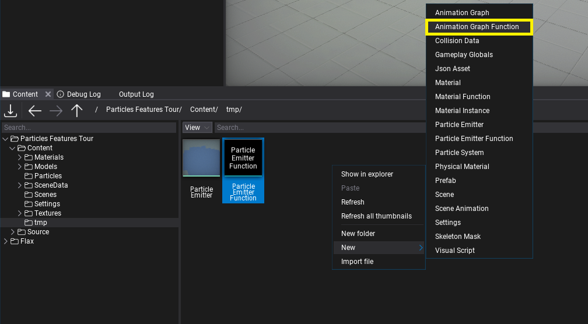
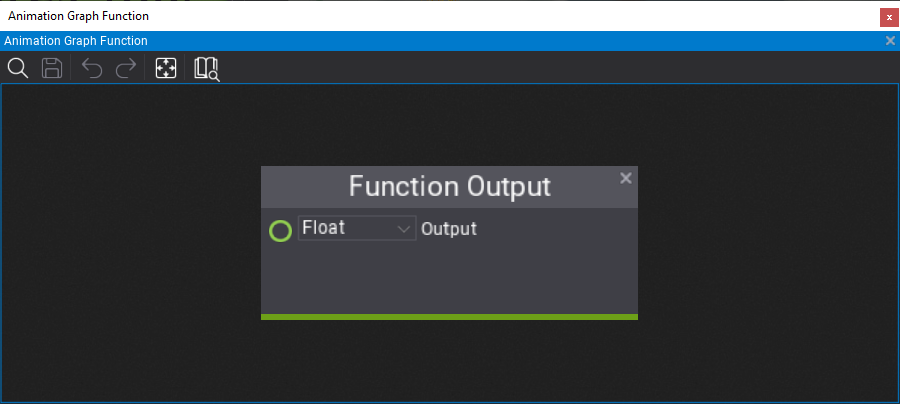
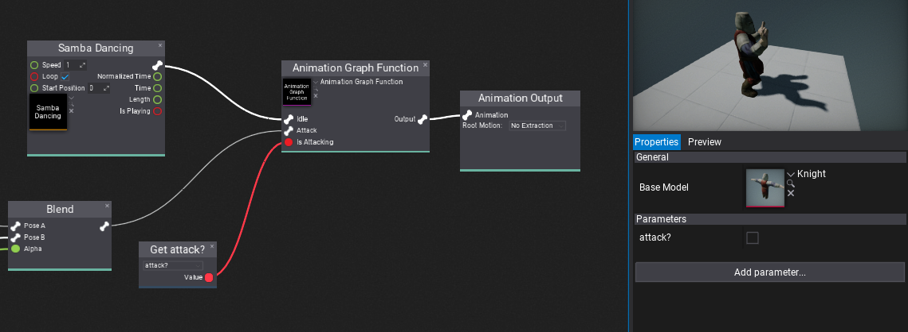

# Anim Graph Functions

**Anim Graph Function** is an asset that contains a reusable animation graph with a set of customizable inputs and outputs. Anim Graph functions can be used in Anim Graphs and other functions to implement custom logic that can be reused multiple times. For instance, you can create a custom IK solver or character state machine and reuse it in different assets. Anim Graph functions are a great way of improving content creation.

## How to create a Anim Graph Function

The first step is to *right-click* in *Content* window and choose option **New -> Animartion -> Animation Graph Function**. Then specify its name and confirm with *Enter*. Open the asset editor by double-clicking on it.

Now, you can let out your creativity and implement literally anything here. Anim Graph Function is a graph of normal Anim Graph nodes but it contains custom **Function Output** and **Function Input** nodes on the graph that represent the function arguments and returned values. Anim Graph function can use animations and perform complex calculations enclosed in a reusable graph.

By default, a new function will contain single *Float* output. You can edit the returned value type using the combobox and rename the output variable by double-clicking on the name label (*Output* by default).

You can create a nested State Machine inside the function that can use function inputs to control the states transitions and animations to play which allows the logic to be reused in different character Anim Graphs. If you use the same input (identified by its name) then the engien will batch those togather and siplay a single input value on the function calling node for simplicity.

## How to use Anim Graph Function

Anim Graph function can be used in any other function (excluding cyclic references) or Anim Graph asset. To use it you can simply drag and drop the asset item into the target graph or use *right-click* and pick **Anim Graph Function** node, then pick the asset you've created. The node will populate the input and output boxes according to the function signature (the same function inputs will be joint).

Finally, Flax will automatically update all graphs using the function if you modify it so you can freely work on the content easily.

