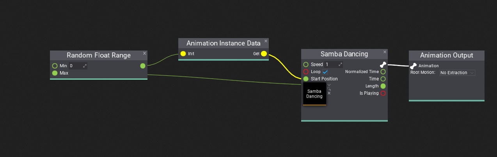

# Instance Data

**Animation Instance Data** is a utility node in Anim Graph that allows to store of per-instance data to be reused inside the graph. The common use-case of that node is to randomize the animation play start position to make a character look more realistic (especially crowds of the same models).

### Example

`Animation Instance Data` gets `Init` value (`Vector4`) when graph gets initialized (or state graph gets active within state machine), then that value can be accessed via `Get` output. In this example, Anim Graph stores the initial time position for the animation playback that is randomized between 0 and length of that animation. This results in randomization of the animation playback which makes the crowd of the models using this graph behave less artificial (eg. when using long idle animations).

