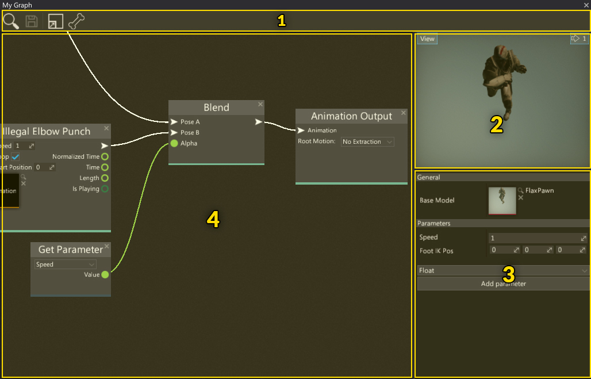
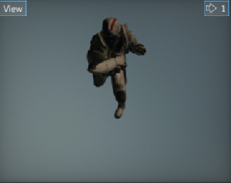
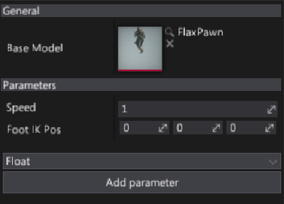
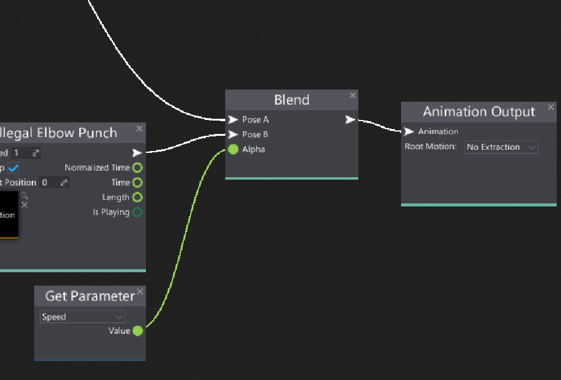
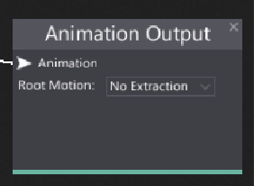
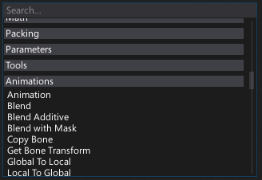
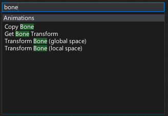

# Anim Graph Window Interface

The Animation Graph editor window UI consists of a toolstrip, viewport, properties panel and surface graph.

1. Toolstrip
2. Viewport
3. Properties Panel
4. Surface Panel

## Toolstrip

The following table lists the options in the toolstrip and what they do.

| Icon | Description |
|--------|--------|
|  | Shows and selects the asset in the *Content* window |
|  | Saves the asset to the file |
|  | Shows the whole material graph on the surface |
|  | Shows the skinned model bone structure |

## Viewport

The viewport panel shows the preview of the current animation. During editing graph (removing the node, connecting boxes, etc.) anim graph is being updated live and all the changes can be seen in the viewport.

You can navigate in the viewport by using the **right mouse button** or zoom in/out by pressing right mouse button and using **mouse scroll wheel**.

Like all viewports in editor, this one also comes up with a *View* widget menu. By pressing that button you can debug animated model material channels, preview different view modes or even change camera field of view angle. To learn more about using the editor viewports and related tools please read [debugging tools](../../graphics/debugging-tools/index.md) page.

## Properties panel

This panel contains all anim graph asset parameters and allows to edit them.
There is a dropdown menu and *Add parameter* button in the bottom of the panel. It's used to add new graph parameters. Simply select new parameter type from the menu and press button to spawn the new one.

Additionally, you can assign the **Base Model** which is a skinned model used as a reference for the animated skeleton source.

To learn more about anim graph parameters see dedicated [Anim Graph Parameters](parameters.md) page.

## Surface

The most important part of the anim graph editor window is a **surface**. This panel contains a graph of all animation nodes that belong to it. By default, each graph contains a single `Animation Output` node. This node has a main *pose* input that is used to evaluate the animated model pose (as shown in a picture below). Also the output node contains the root motion mode dropdown menu.

# Navigation controls

Controls in the Anim Graph Editor generally match the controls of other tools in the Flax Editor. For example, the material node graph can be navigated as with other linked object editors, the material preview mesh can be oriented as per other mesh tools, etc.

## Mouse controls

| Control | Action |
|--------|--------|
| **RMB** drag on background | Pan nodes graph  |
| **RMB** on background | Show node creation menu |
| **RMB** on node | Show node edit menu |
| **LMB** drag on background | Select nodes with rectangle tool |
| **LMB** on node | Select node |
| **Ctrl + LMB** on node | Toggle selection of node |
| **LMB** on node header | Move selected nodes |
| **Mouse Wheel** | Zoom in/out |

## Keyboard controls

| Control | Action |
|--------|--------|
| **Ctrl + S** | Save the asset |
| **Ctrl + A** | Select all nodes |
| **Ctrl + C** | Copy selected nodes to the clipboard |
| **Ctrl + V** | Paste nodes from the clipboard |
| **Ctrl + X** | Cuts the selected nodes to the clipboard |
| **Ctrl + D** | Duplicate selected nodes |
| **Delete** | Delete selected nodes |
| **Escape** | Deselect nodes |
| **Arrow keys** | Move selected nodes |
| **//** | Create comment around selected nodes |

# Adding new node

In order to add a new anim graph node right click on a surface background and select a node type from a popup or type its name to find it.

