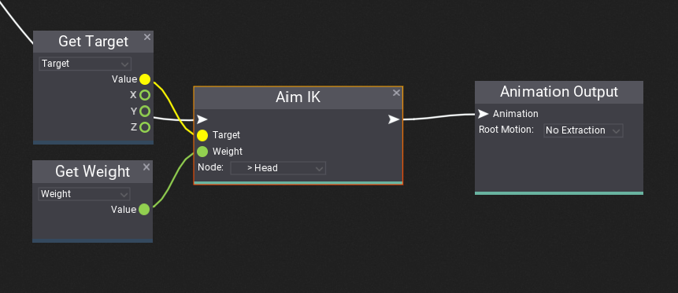

# Inverse Kinematics

**Inverse Kinematics** (shorten as **IK**) is a solution to perform reactive animation that better fits the gameplay environment. This feature can be for instance used to:
* make character look at desire object
* place character foot on the uneven ground
* grab gun with player hands
* pick up bottle with player hand.

Flax provides various nodes for Anim Graph that support adding IK to games. Follow this documentation to learn how to enrich your gameplay. You can also implement custom animations processing nodes using [custom nodes](custom-nodes.md) feature.

## Aim IK

**Aim IK** rotates a node so it aims at a target. You can use this node to make player look at the specific object by rotating player *head* node. This node can be also used to rotate player feet to align to the ground surface normal vector.

The node takes animated pose and adjusts the specified *node* rotation. The *target* input is a location for node to aim to defined in mode-space (local space of the Animated Model actor). The *weight* is alpha blend of the aiming correction (normalized to range 0-1).

## Two Bone IK

**Two Bone IK** performs inverse kinematic on a three nodes chain (2 nearby bones). You can use this node to place character hand or feet over the specific target location or make player grap the weapon with both hand 

The node takes animated pose and adjusts the specified *node*, *parent node* and *parent of the parent node* transformations. The *target* input is a location for node to reach which defined in mode-space (local space of the Animated Model actor). The *weight* is alpha blend of the aiming correction (normalized to range 0-1).
The input property *Joint Target* specifies the target location for the middle node (joint) to target to and can be used to orient the middle node into a specific direction (eg. make player elbows move ouside the spline, instead of penetrate body).
If the target cannot be reached (eg. target is too far) the node can strech bones up to specified *Max Stretch Scale*. You can enable it by checking *Allow Stretching*.eached (eg. target is too far) the node can strech bones up to specified *Max Stretch Scale*. You can enable it by checking *Allow Stretching*.

