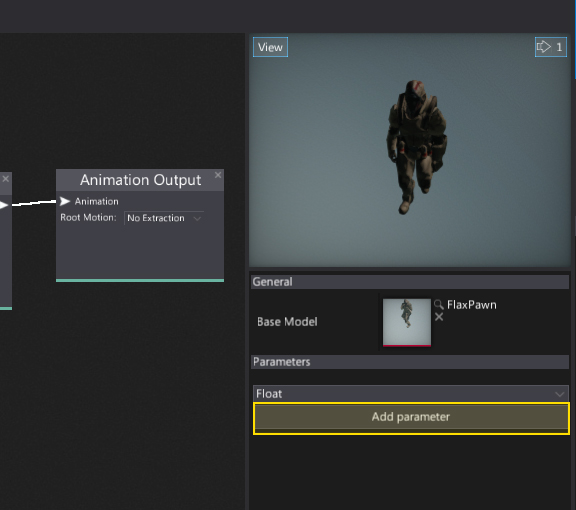
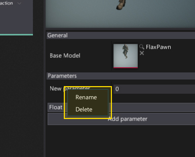
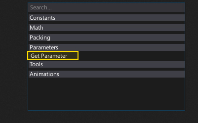
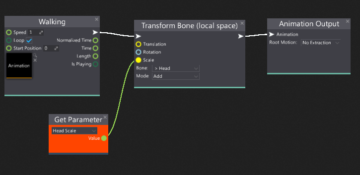
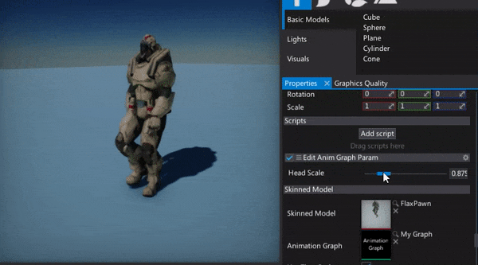
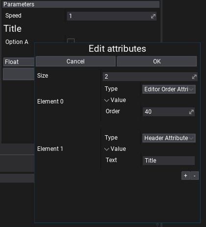

# Anim Graph Parameters

Anim Graph parameters are **public variables** of the graph which can be modified from the outside to configure its logic.
For example, you can create a parameter called **Speed** and use it to blend between *Run* and *Walk* animations fo your character to implement the proper animation playback for your game.

Using graph parameters allow you to implement desired gameplay features and extend the default skeleton animation playback in order to use Inverse-Kinematics (IK), transform single bone or simply blend between the set of animations using the parameters passed from the C# source. It is a very common technique to create the player animation controller script and pass the animation control variables like `Move Forward`, `Move Right`, `Is Jumping` to the graph and implement the proper animation logic.

## Creating and using parameters



Creating graph parameters is done using the [Anim Graph Editor Window](interface.md) which contains a dedicated panel with properties.
To do it simply specify the parameter type (with combo box menu) and click the **Add parameter** button. It will add a new parameter. You can rename or remove the created parameters by using the dedicated context menu. Simply right click on a parameter name label. You can also specify the default value for the parametrs.



To access this parameter in the graph spawn the **Get Parameter** node and then select your parameter from the dropdown menu.



After that connect your parameter outputs with the other nodes to implement the desired usage. In this example, the **Head Scale** parameter is used to scale the skeleton bone using the **Transform Bone (local space)** node. Note that Anim Graph supports implicit type casting so the value type **float** gets converted into the **Float3** type which is used for the bone transformation scale.



## Using Anim Graph parameters from code

Created Anim Graph parameters can be accessed from C# script. You can cache the graph parameters, iterate over them and access from any part of your code. Here is an example code that updates the single graph parameter.

# [C#](#tab/code-csharp)
```cs
using FlaxEngine;

public class EditAnimGraphParam : Script
{
	[Range(0.5f, 2.5f)]
	public float HeadScale  = 1.0f;

	private AnimGraphParameter _parameter;

	public override void OnStart()
	{
		// Cache the parameter handle
		_parameter = Actor.As<AnimatedModel>().GetParameter("Head Scale");
	}

	public override void OnUpdate()
	{
		// Update the value
		_parameter.Value = HeadScale;
	}
}
```
# [C++](#tab/code-cpp)
```cpp
#include "Engine/Scripting/Script.h"
#include "Engine/Animations/Graph/AnimGraph.h"
#include "Engine/Level/Actors/AnimatedModel.h"

API_CLASS() class GAME_API EditAnimGraphParam : public Script
{
    API_AUTO_SERIALIZATION(EditAnimGraphParam);
    DECLARE_SCRIPTING_TYPE(EditAnimGraphParam);

private:
    AnimGraphParameter* _parameter;

public:
    API_FIELD(Attributes="Range(0.5f, 2.5f)")
    float HeadScale = 1.0f;

public:
    void OnStart() override
    {
        // Cache the parameter handle
        _parameter = Cast<AnimatedModel>(GetActor())->GetParameter(TEXT("Head Scale"));
    }
    void OnUpdate() override
    {
        // Update the value
        _parameter->Value = HeadScale;
    }
};
```
***

Result:



## Attributes

Every parameter can have a collection of customizable **attributes** that can customize it's display logic in UI or be used as metadata for other systems (eg. serialization).

To add attribute to parameter simply **right-click -> Edit attributes**, then use **+** button to add new attribute, set **Type** to one of the items from the dropdown list, adjust properties of the atrtribute and hit **OK** to confirm.

For instance, Tooltip Attribute can be used to display documentation note about parameter for other users. Range and Slider attributes can help to customize editing scalar values and Ediotr Group and Editor Order can organize the list of parameters. To learn about attribute types see [this page](../../scripting/attributes.md).


