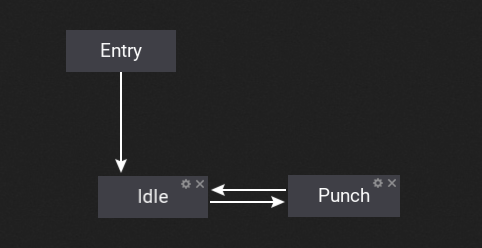
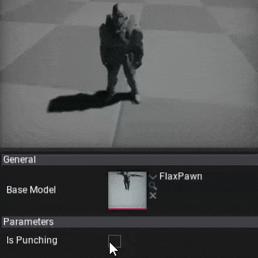
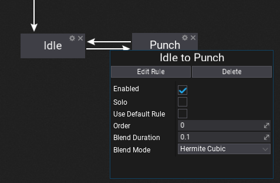
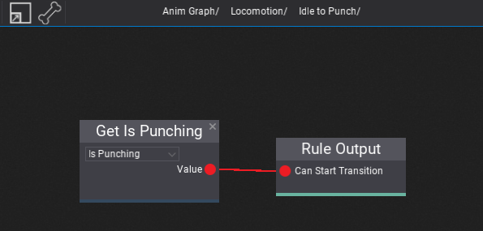

# State Machines

Anim Graph can contain nested **state machine** nodes that can be used to define the animated character states and perform smooth transitions between them. State machines provide a visual way to divide the animation logic into a series of states. Each state can define the custom animation pose logic that it represents (common states are **Idle**, **Run**, **Falling**, etc.). These states are then governed by transitions that control how to blend from one state to another.

Using state machine scan greatly simplify the design and implementation process of creating animated models. Using graph with visualized animation states and connection between can improve the tool workflow even when working with complex characters. Follow this documentation section to learn more how to use them in your project.

## How to create a state machine?

To learn how to create and use state machine in Anim Graph please follow [this tutorial](../tutorials).

## State Transitions

Each transition has a set of various properties that you can define. Disabled transitions are gray-out in the editor to help you guide. You can also adjust the transition time and blending mode. Option **Use Default Rule** can be used to fire the automatic transition when the state animation is about to end. This is useful when creating single-shot states without manually creating a rule.

### Transition Properties

| Property | Description |
|--------|--------|
| **Enabled** | If checked, the transition can be triggered, otherwise it will be ignored. |
| **Solo** | If checked, animation graph will ignore other transitions from the source state and use only this transition. |
| **Use Default Rule** | If checked, animation graph will perform automatic transition based on the state animation pose (single shot animation play). |
| **Order** | The transition order. Transitions with the higher order are handled before the ones with the lower order. |
| **Blend Duration** | Transition blend duration (in seconds). |
| **BlendMode** | Transition blending mode for blend alpha. |

## Transition Rule

To edit state transition rule trigger logic use **Edit Rule** button or **double-click** on it (on connection line).
Then the transition graph will show. Again, it works like a State Machine graph. This sub-graph contains a single output node that samples the boolean value which determinates whenever trigger the transition.

Also, remember about using special **Transition Source State Anim** node that can be added to the transition graph to access the source state animation playback information. It can be used to trigger the animation in a specific moment, for instance when the source state animation is about to end.

