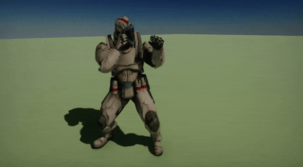
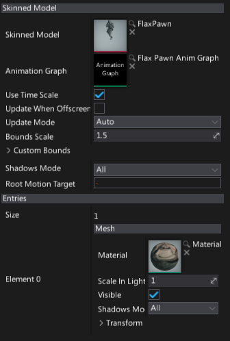

# Animated Model

**Animated Model** is an actor type that performs an animation and renders a skinned model.
It uses an animation graph instance to evaluate the skinned model bone transformations.

Before you can use animated model in your game you will need to import a [Skinned Model](skinned-model/index.md) and create an [Anim Graph](anim-graph/index.md).

## Usage

To learn how to setup and use the animated model please see the dedicated tutorials: [How to setup animated model](tutorials/setup-animated-model.md) and [How to change Anim Graph parameter from code](tutorials/change-anim-graph-param.md).

## Scripting

Animated Model actor exposes a rich C# scripting API. You can modify the anim graph instanced parameters values via [AnimatedModel.Parameters](fixmeeee), modify rendered model meshes materials via [AnimatedModel.Entries](fixmeeee), gather the current skeleton bones pose via [AnimatedModel.GetCurrentPose](fixmeeee), or even manually update animation via [AnimatedModel.UpdateAnimation](fixmeeee).

## Properties

| Property | Description |
|--------|--------|
| **Skinned Model** | Skinned model asset used for rendering. |
| **Animation Graph** | Animation graph used for the skinned mesh skeleton bones evaluation. |
| **Use Time Scale** | If checked, animation speed will be affected by the global time scale parameter. |
| **Update When Offscreen** | If checked, the animation will be updated even when an actor cannot be seen by any camera. Otherwise, the animations themselves will also stop running when the actor is off - screen. |
| **Update Mode** | The animation update mode. Can be used to optimize the performance. Possible options: <table><tbody><tr><th>Option</th><th>Description</th></tr><tr><td>**Auto**</td><td>The automatic updates will be used (based on platform capabilities, distance to the player, etc.).</td></tr><tr><td>**Every Update**</td><td>Animation will be updated every game update.</td></tr><tr><td>**Every Second Update**</td><td>Animation will be updated every second game update.</td></tr><tr><td>**Every Fourth Update**</td><td>Animation will be updated every fourth game update.</td></tr><tr><td>**Manual**</td><td>Animation can be updated manually by the user scripts. Use AnimatedModel.UpdateAnimation() method.</td></tr><tr><td>**Never**</td><td>Animation won't be updated at all.</td></tr></tbody></table>|
| **Bounds Scale** | Master scale parameter for the actor bounding box. Helps reducing mesh flickering effect on screen edges. |
| **Custom Bounds** | Custom bounds (in actor local space). If set to empty bounds then source skinned model bind pose bounds will be used. |
| **Shadows Mode** | Shadows casting mode by meshes using this entry. Possible options:  <table><tbody><tr><th>Option</th><th>Description</th></tr><tr><td>**None**</td><td>Never render shadows.</td></tr><tr><td>**Static Only**</td><td>Render shadows only in static views (env probes, lightmaps, etc.).</td></tr><tr><td>**Dynamic Only**</td><td>Render shados only in dynamic views (game, editor, etc.).</td></tr><tr><td>**All**</td><td>Always render shadows.</td></tr></tbody></table> |
| **Root Motion Target** | Animation root motion apply target. If not specified the animated model will apply it itself. |

