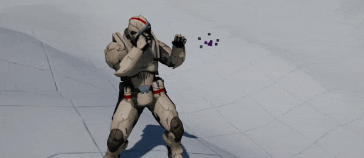
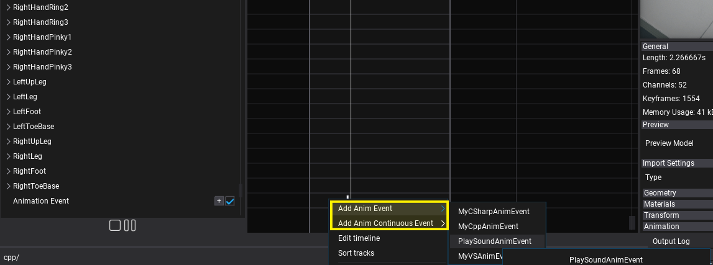
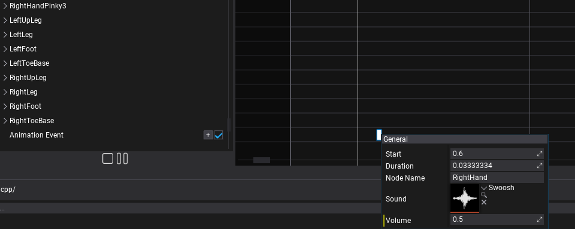
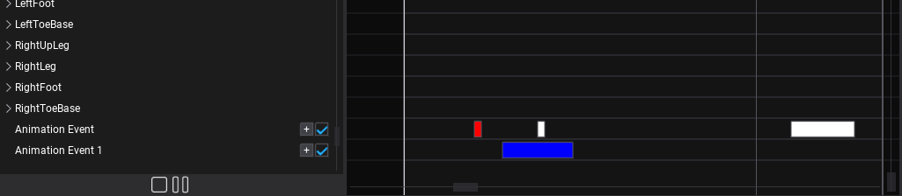

# Animation Events



Animation timeline supports special **Animation Event** tracks that can contain custom single-shot or continuous events. Those can be used to play footsteps sounds, spawn footstep decals or apply other animation-based effects into the gameplay.

There are 2 types of animation events:
* `AnimEvent` - animation notification event triggered during animation playback with a single callback executed once when animation playback passes through the given frame.
* `AnimContinuousEvent` - animation notification event (with duration) triggered during animation playback that contains begin and end (event notification is received as a tick). It differs from a single event in that it is updated during every animation tick and is guaranteed to receive start before any ticking and end after all ticks occurred.

### Multithreading

By default Animation System uses the Job System to update all animated models asynchronously during game updates. This allows to greatly improve performance for scenes with a large number of objects. As a result, the animation event callbacks are invoked on job threads (the main thread is sleeping). Thus it's important to safely access other gameplay data during events to ensure it doesn't result in race conditions. In general, accessing a single Animated Model object or its scripts/children is safe as every model instance is updating its own animation only once during this async routing (you can spawn or edit objects belonging to that animated model within an event).

To learn more about multithreading see [this documentation](../../scripting/advanced/multithreading.md).

### Data and cache

Engine creates `AnimEvent` object instances within `Animation` asset during loading. Those are reused by animated models when playing the animation thus caching any data or state within a custom animation event needs to be done with caution. For example, `AnimContinuousEvent` can store data in `OnBegin` and clear in `OnEnd` (guaranteed to be always called). But keep in mind that a single `AnimEvent` object can receive multiple different callbacks from different animated objects at the same time - literally at the same time because Animation System schedules Anim Graph updates with async Job System. This means that data stored in Anim Event or reused globally (eg. character state accessed via `AnimatedModel`) needs to be accessed cautiously (see Multithreading section above).

## How to create Anim Event type?

Game and plugins can define custom anim event types with instanced data and custom gameplay logic. Here is an example of custom anim event which plays a sound clip on event at the given skeleton node location. It can be used to play character footsteps sounds or be extended to spawn VFX and Decal too.

# [C#](#tab/code-csharp)
```cs
using FlaxEngine;

/// <summary>
/// Plays the sound clip at the given skeleton node location.
/// </summary>
public class PlaySoundAnimEvent : AnimEvent
{
    /// <summary>
    /// The sound clip to play.
    /// </summary>
    public AudioClip Sound;

    /// <summary>
    /// The sound volume.
    /// </summary>
    [Limit(0, 1)]
    public float Volume = 1.0f;

    /// <summary>
    /// The name of the node to play sound at it's location (eg. left foot).
    /// </summary>
    public string NodeName;

    /// <inheritdoc />
    public override void OnEvent(AnimatedModel actor, Animation anim, float time, float deltaTime)
    {
        // Play sound at the bone location (eg. foot)
        var node = actor.SkinnedModel.FindNode(NodeName);
        actor.GetNodeTransformation(node, out var nodeMatrix);
        var source = new AudioSource
        {
            HideFlags = HideFlags.FullyHidden,
            Volume = Volume,
            Clip = Sound,
            Position = nodeMatrix.TranslationVector,
            Parent = actor,
        };
        source.Play();

        // Auto remove source after playback ends
        // TODO: use object pooling
        Destroy(source, Sound.Length);
    }
}
```
# [C++](#tab/code-cpp)
```cpp

#pragma once

#include "Engine/Core/Math/Matrix.h"
#include "Engine/Animations/AnimEvent.h"
#include "Engine/Content/AssetReference.h"
#include "Engine/Level/Actors/AnimatedModel.h"
#include "Engine/Audio/AudioClip.h"
#include "Engine/Audio/AudioSource.h"

/// <summary>
/// Plays the sound clip at the given skeleton node location.
/// </summary>
API_CLASS() class GAME_API PlaySoundAnimEvent : public AnimEvent
{
API_AUTO_SERIALIZATION();
DECLARE_SCRIPTING_TYPE(PlaySoundAnimEvent);

    /// <summary>
    /// The sound clip to play.
    /// </summary>
    API_FIELD() AssetReference<AudioClip> Sound;

    /// <summary>
    /// The sound volume.
    /// </summary>
    API_FIELD(Attributes="Limit(0, 1)") float Volume = 1.0f;

    /// <summary>
    /// The name of the node to play sound at it's location (eg. left foot).
    /// </summary>
    API_FIELD() String NodeName;

    // [AnimEvent]
    void OnEvent(AnimatedModel* actor, Animation* anim, float time, float deltaTime) override
    {
        CHECK(Sound);

         // Play sound at the bone location (eg. foot)
        int32 node = actor->SkinnedModel->FindNode(NodeName);
        Matrix nodeMatrix;
        actor->GetNodeTransformation(node, nodeMatrix);
        auto source = New<AudioSource>();
        source->HideFlags = HideFlags::FullyHidden;
        source->Clip = Sound;
        source->SetVolume(Volume);
        source->SetPosition(nodeMatrix.GetTranslation());
        source->SetParent(actor);
        source->Play();

        // Auto remove source after playback ends
        // TODO: use object pooling
        source->DeleteObject(Sound->GetLength());
    }
};
```
***

## How to add Anim Event?

Animation events use a separate track type inside Animation asset and can be easily placed on a timeline to trigger at very specific time locations. Use *Add* button and select *Animation Event* track. Then use `+` button or *right-click* on that track to insert a new animation event.



Then you can *double-click* on created event or *right-click* to edit its properties.



After saving asset it will use the created event during animation playback.

## Continuous Events

Continuous events are normal anim event which contain a fixed duration with well defined start and end. Those are usefull for time-based actions like attack logic for gameplay based on animations timing.

Continuous events can override additional methods:
* `OnStart`
* `OnEnd`

## Event Color



Every event type can adjust `Color` field to control the appearance in the Editor. This can be used to distinguish SFX, VFX or other events when editing more complex assets.
