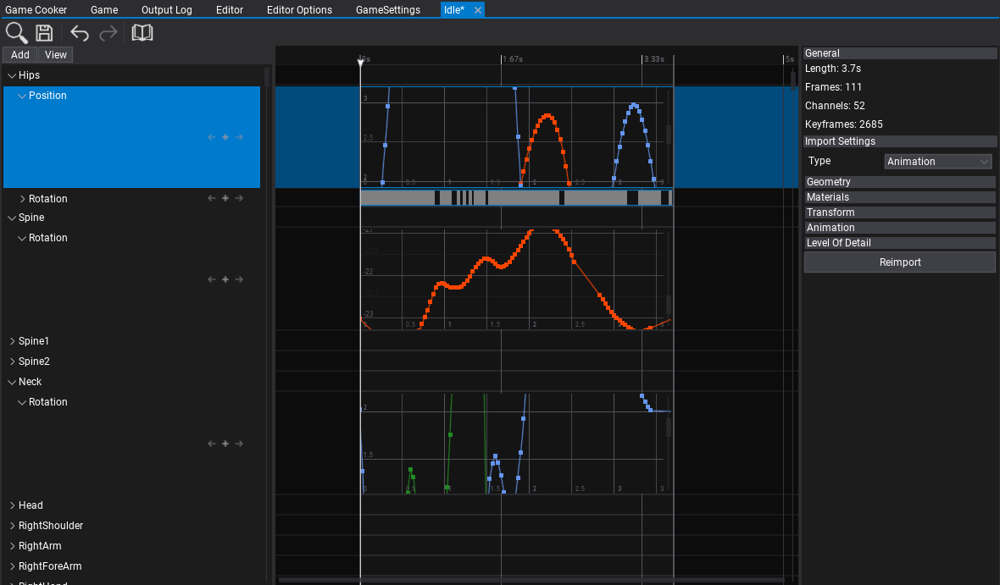
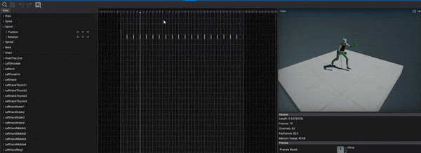

# Animation

**Animation** asset contains a set of bone animation channels and curves. It's used to animate [skinned model](../skinned-model/index.md) skeleton bones.

## Importing animations

Importing animation files works in the same way as for other asset types. Simple drag and drop the model files from *Explorer* into the *Content* window or use the *Import* button.

After choosing the files **Import file settings** dialog shows up. It's used to specify import options per asset. In most cases the default values are fine and you can just press the **Import** button.

> [!Note]
> Using **Import file settings** dialog you can select more than one asset at once (or use **Ctrl+A** to select all) and specify import options at once.

Every asset can be reimport (relative path to the source file is cached) and import settings modified using Animation Window.

To learn more about **Import Options** see [Models Importing page](../../graphics/models/import.md).

## Using animations

To use the imported animation clip you can drag and drop it into the Anim Graph surface or add manually *Animation* node.
Then connect the animation pose with the animation output and see the animated mode.

## Animation editor window

Double-click the animation asset in the *Content* window to show it in teh dedicated editor window.
The window contains 2 panels: **timeline** and **properties**.
The timeline allows to inspect and edit imported animation. Each animated node channel contains subtracks for position, rotation or scale.
The properties panel shwos the general information about asset such as: the total animation length, amount of animated channels and the total keyframes amount. Also it's very easy way to modify the import settings and reimport the source asset.

## Animation preview

To preview animation on a model set the **Preview Model** property. It will display the preview panel and synchronize the timeline current frame position with the  animation preview. It can be used to analyze and debug animation. Animation preview contains widgets to play/pause (F5/F6 keys) or to change the playback speed (via **View -> Playback Speed**). You can also control playback with timeline position handle and keyboraed (Space to play/pause, Arrows to navigate).
