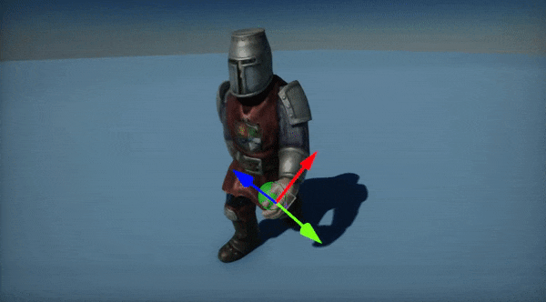
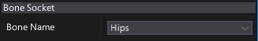

# Bone Socket

**Bone Socket** is an actor type that links to the [animated model](animated-model.md) skeleton bone transformation. It can be used to link the player gun to the hand bone or to raycast the player foot IK target locations. It simply tracks the skeleton bone transformation.

## Usage

In order to use a bone socket simply attach it as a child actor to the [animated model](animated-model.md) actor. It will automatically update and track the target bone transform. Then you can attach other objects to that bone socket. The image above shows an example where a green ball is attached to a bone socket which tracks the character hand movement.

## Properties

| Property | Description |
|--------|--------|
| **Bone Name** | The name of the skeleton bone that socket is attached to. |
