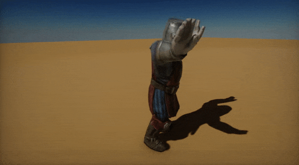

# Animation

One of the most fundamental parts of every game are **animations**. Flax Engine features a high quality and performant animation system that helps developers achieve life-like characters and animations.
This documentation section describes how to work with the Flax animation pipeline. Follow the guidelines and tutorials to create your very own animated characters.

>[!Note]
>As a starting point, we recommend checking out the following tutorial: [How to setup animated model](tutorials/setup-animated-model.md).

## In this section

* [Skinned Model](skinned-model/index.md)
 * [Editor Interface](skinned-model/interface.md)
* [Animation](animation/index.md)
* [Anim Graph](anim-graph/index.md)
 * [Editor Interface](anim-graph/interface.md)
 * [Graph Parameters](anim-graph/parameters.md)
 * [State Machines](anim-graph/state-machine.md)
 * [Inverse Kinematics](anim-graph/inverse-kinematics.md)
 * [Custom Nodes](anim-graph/custom-nodes.md)
* [Animated Model](animated-model.md)
* [Skeleton Mask](skeleton-mask.md)
* [Bone Socket](bone-socket.md)
* [Scene Animations](scene-animations/index.md)
 * [Scene Animation](scene-animations/scene-animation.md)
 * [Scene Animation Player](scene-animations/scene-animation-player.md)
 * [Tutorials](scene-animations/tutorials/index.md)
   * [How to animate actor](scene-animations/tutorials/animate-actor.md)
   * [How to make a cut-scene](scene-animations/tutorials/cut-scene.md)
   * [How to animate UI](scene-animations/tutorials/animate-ui.md)
   * [How to use event track](scene-animations/tutorials/event-track.md)
   * [How to create scene animation from code](scene-animations/tutorials/scene-anim-from-code.md)
* [Advanced](advanced/index.md)
 * [Root motion](advanced/root-motion.md)
 * [Bones debugging](advanced/bones-debugging.md)
* [Tutorials](tutorials/index.md)
 * [How to setup animated model](tutorials/setup-animated-model.md)
 * [How to create Anim Graph](tutorials/create-anim-graph.md)
 * [How to use Anim Graph](tutorials/use-anim-graph.md)
 * [How to change Anim Graph parameter from code](tutorials/change-anim-graph-param.md)
 * [How to blend two animations](tutorials/blend-anims.md)
 * [How to use Skeleton Mask](tutorials/use-skeleton-mask.md)
 * [How to setup State Machine](tutorials/setup-state-machine.md)
