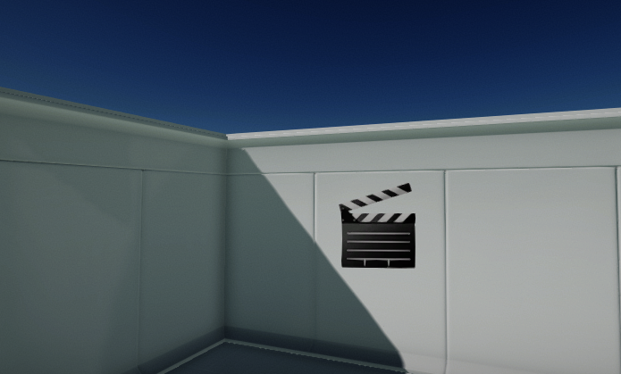
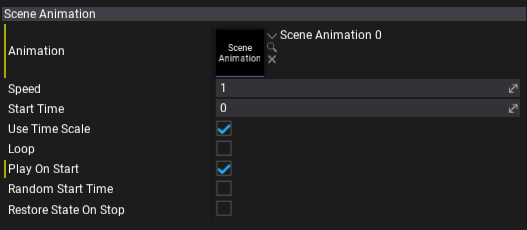

# Scene Animation Player

**Scene Animation Player** is an actor type that can playback the [Scene Animation](scene-animation.md) sequence. It can play it on start or after calling a play from the script. The playback speed and looping options can be adjusted.

## Restoring state on end

Scene Animation Player supports caching the animated objects state on play start and restoring it on the end. This can be useful in certain gameplay situations. To enable it simply check the *Restore State On Stop* option. If used the playback start will take longer since the state has to be cached (additional memory allocation and the processing of the data).

## Objects and Tracks mapping

In some cases, such as prefab object animation or instanced animation you might want to change the animated object to something else. To do that you can use `MapObject(Guid from, Guid to)` or `MapTrack(string from, Guid to)` function from player. Both can be used to redirect the animated object in the asset to an other object.

## Properties

| Property | Description |
|--------|--------|
| **Animation** | The scene animation to play. |
| **Speed** | The animation playback speed factor. Scales the timeline update delta time. Can be used to speed up or slow down the sequence. |
| **Start Time** | The animation start time. Can be used to skip part of the sequence on begin. |
| **Use Time Scale** | Determines whether the scene animation should take into account the global game time scale for simulation updates. |
| **Loop** | Determines whether the scene animation should loop when it finishes playing. |
| **Play On Start** | Determines whether the scene animation should auto play on game start. |
| **Random Start Time** | Determines whether the scene animation should randomize the start time on play begin. |
| **Restore State On Stop** | Determines whether the scene animation should restore initial state on playback stop. State is cached when animations stats play after being stopped (not paused). |
| **Update Mode** | The animation update mode that describes the scene animation updates frequency. Possible options: <table><tbody><tr><th>Option</th><th>Description</th></tr><tr><td>**Every Update**</td><td>Animation will be updated every game logic update.</td></tr><tr><td>**Manual**</td><td>Animation can be updated manually by the user scripts.</td></tr></tbody></table> |
