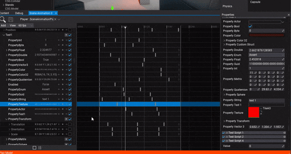
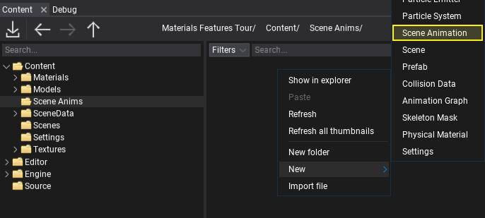
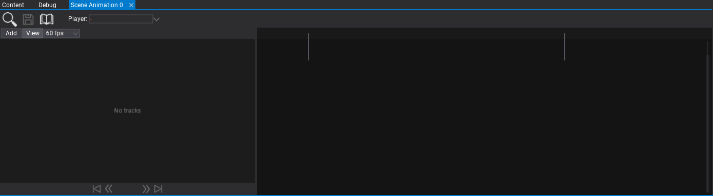
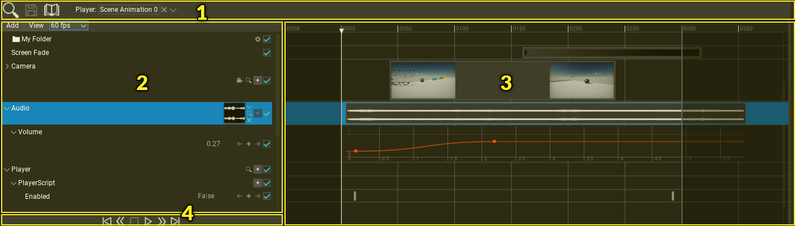
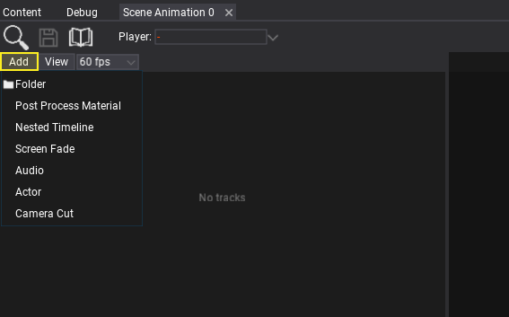
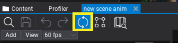
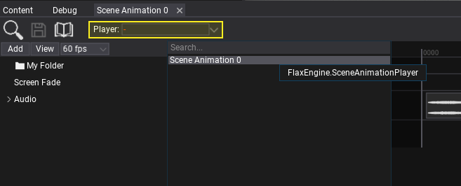
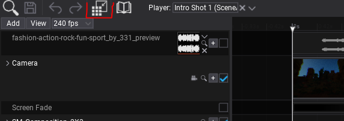

# Scene Animation



**Scene Animation** in a binary asset that contains a timeline that is made of a set of tracks. Various types of tracks can be used to animate objects, invoke events, playback audio or perform other operations such as screen fading. This documentation page describes how to create and edit a scene animation asset. To play the animation use the [Scene Animation Player](scene-animation-player.md) actor.

## Create a scene animation

To create a new animation asset use the *Content* window. Right-click in the Content directory and select option **New -> Scene Animation**. Then specify the name and press Enter to confirm.



Now open the asset (double-click on it) and edit it. You can dock the floating window in the bottom panel to have a better overview around it and can edit the scene at the same time.



## Interface

Scene animation editor interface is divided into several parts as shown in the picture below:
1. Toolstrip
2. Tracks panel
3. Timeline panel
4. Playback controls



Editor window provides various functionalities to view and edit animation. The left panel contains a hierarhical list of tracks. You can use it to organize them, rename, edit, mute or remove. The right side of window contains a timeline that matches the vertical hierarchy of the tracks and contains their media events. You can select and drag media with left mouse button or use right click to open context menu.

Timeline uses the concept of **frame** to represent the time. Whole timeline animation uses a given frames per second factor (FPS) to define the playback speed (the speed of animation frames to play per second). You can edit timeline time axis labels by using **View -> Show time as**. The timeline FPS can be changed using the dedicated toolstrip button (default is *60 fps*). You can use one of the common, predefined values or set the custom fps.

Mouse controls:
* **Left-click + move** - select keyframes or move selection
* **Right-click + move** - navigate
* **Right-click** - open context menu
* **Scroll wheel** - scroll
* **Scroll wheel + Shift** - scroll time
* **Scroll wheel + Ctrl** - zoom in/out

Keyboard shortcuts:
* **Arrow Left** - sets time to the previous frame
* **Arrow Right** - sets time to the next frame
* **Home** - sets time to first frame
* **End** - sets time to last frame
* **Page Up** - sets time to frame of the next keyframe
* **Page Down** - sets time to frame of the previous keyframe
* **Ctrl + S** - saves the assett
* **Spacebar** - pauses or plays the playback
* **S** - splits the media events at the current frame (if possible)

## Editing scene animation

To add a new track to the timeline use **Add** button. This will show the selection of track types that can be added. You can also **drag and drop actors or scripts** to the tracks panel to add animation track for those objects.



Once you add a track you can edit its properties. This depends on the track type. For instance, Actor track will allow you to add subtracks to animate its properties or child scripts. To learn more about tracks types see *Tracks* section below.

If your animation sequence contains many tracks you can organize them into **folder hierarchy** including color coding for easier editing.

You can use **right click on the timeline** to edit selected media properties or the timeline properties.

## Tracks

#### Folder

**Folder** track is used to organize one or more tracks in the hierarchy. It can be used for grouping the tracks and making the scene animation timeline easier to work with.

#### Post Process Material

**Post Process Material** track applies the given postFx material (without blending) within the timeline media event. To learn more about post-process material see [this page](../../graphics/post-effects/post-fx-materials.md).

#### Nested Timeline

**Nested Timeline** is a track that can be used to play another timeline. This can because very handy when doing more advanced scene animations or cut-scenes. For instance, big cut-scene for the final boss fight can be split into sections that are composited together in the master sequence.

#### Screen Fade

**Screen Fade** track applies the screen fade color over time. It can be adjusted to fade between two different camera shots or to fade out the cut-scene.

#### Audio

**Audio** track plays the given audio clip. Right-click on the timeline media to edit the playback properties such as looping mode. You can also add a volume subtrack using the **+** button to animate the audio volume over time.

#### Actor

**Actor** track contains a reference to the actor object. You can use it to animate its properties and child scripts. Use **+** button to add subtracks. Right-click on track header to change the animated actor.

#### Camera Cut

**Camera Cut** it a special type of Actor track that is used for Camera shots animations. It contains a media event that defines the camera shot with the preview thumbnails. Use **+** button to animate camera properties during the cut. For camera shots editing use **camera icon** that starts the camera actor pilot mode which enables you to move and orient camera to the editor viewport. Then use the viewport widget to stop acotr piloting and add keyframes for the camera shot location. Right-click on track header to change the animated camera.

## Live-preview

Scene Animation Editor allows to playback and preview the asset while editing. To enable this feature simply check the live-preview icon on the toolbar.



Then you will be able to seek the timeline and see the animation preview on a scene. You can also play the animation. This improves the editing process and can help when working with more complex cut-scenes.

## Playback preview

Scene animation editor windows supports previewing the animation playback during the game. The game must be running in Flax Editor for animation playback to work. Simply use the animation player actor picker, start the game in Flax Editor and you will be able to preview its state as well as control playback (via play/pause buttons) and use the seeking.



## Rendering animation


Scene Animation window supports **rendering cut-scenes** and in-game sequences. This can be useful to record in-game trailers or marketing materials right in the Editor. This tool supports various options such as animation render framerate and resolution. In that way, you can pre-render your cut-scene in 4K@60FPS. To use it simply click on the toolbar button (image below), adjust options, and click **Render** button. By default the rendered sequence will be located in your project sub-folder `Output/Render` but you can adjust it too.



To create a video clip (eg. `.mp4` file) from captured cut-scene stills you can use the tool [FFmpeg](https://ffmpeg.org/) tool with the command line (inside the output folder):

```
ffmpeg -framerate 60 -i %d.png vid.mp4
```

Where:
* `-framerate 60` - specifies the frame rate of the movie (eg. 60 frames per second),
* `-i %d.png` - specifies the rendered stills name (eg. `%d.png` will work if you set *Filename* to `{frame}` in Output options and set *Video Output Type* to `Image (.png)`),
* `vid.mp4` - specifies the name of the output file.
