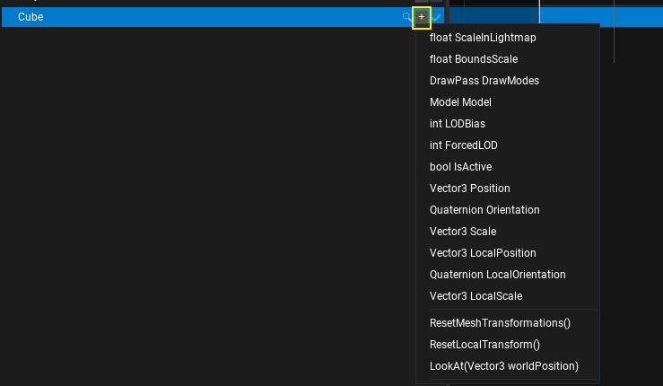
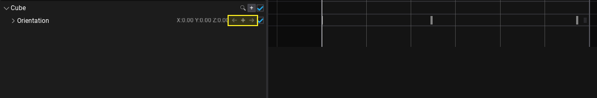
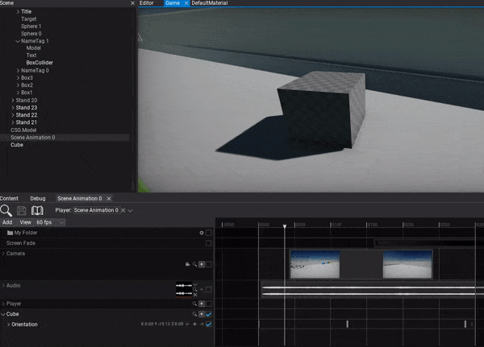

# HOWTO: Animate Actor

In the following tutorial, you will learn how to animate an actor. To learn how to create scene animation see this [page](../scene-animation.md).

## Tutorial

### 1. Select the actor you want to animate

### 2. Add actor track

You can drag and drop the actor into the tracks panel or use button Add -> Actor to create new track and pick the actor to animate it.

### 3. Add subtrack

Use the **+** button and pick the actor's property you want to animate. You can animate multiple properties and fields at once and also call actor methods. This also allows adding separate subtrack for the child scripts attached to this actor and animating their properties.

### 4. Add keyframes

Now you can insert keyframes to the property track. To do so use the **+** button as shown in the picture below. You can also use right-click to open the context menu and choose **Add keyframe** option.

### 5. Play the animation

The final step is to add Scene Animation Player actor and play this animation.

