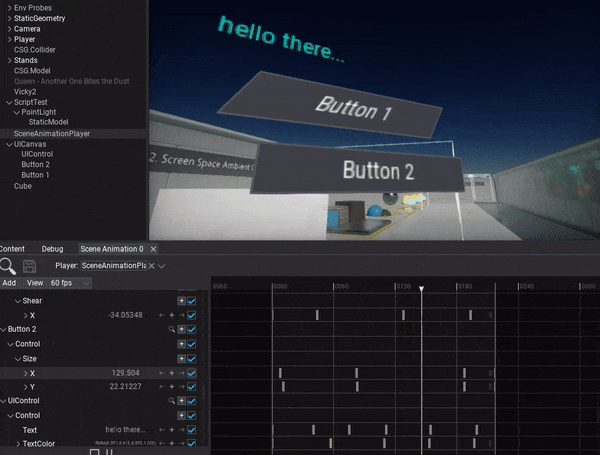
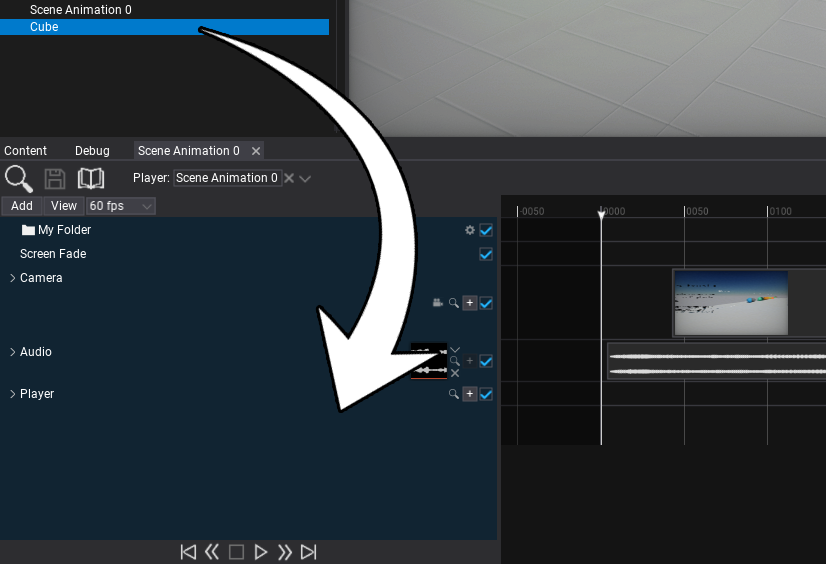
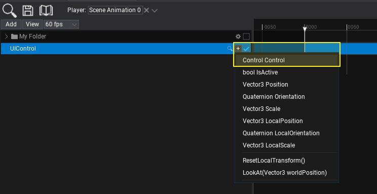
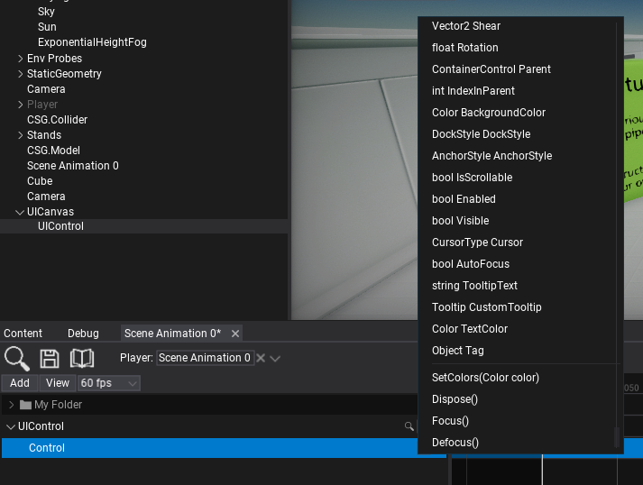
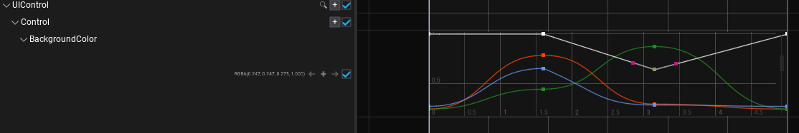
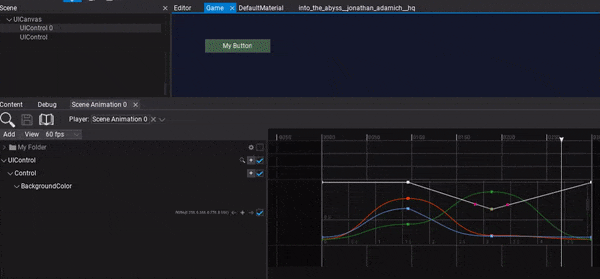

# HOWTO: Animate UI

In the following tutorial, you will learn how to animate GUI control. To learn how to create scene animation see this [page](../scene-animation.md).

## Tutorial

### 1. Select the *UI Control* you want to animate

### 2. Add actor track

You can drag and drop the actor into the tracks panel or use button Add -> Actor to create new track and pick the actor to animate it.

### 3. Add *Control* subtrack

Use the **+** button and pick the **Control** to add subtrack for animating GUI control object.

### 3. Add subtrack

Use the **+** button and pick the control's property you want to animate. You can animate multiple properties and fields at once and also call control methods.

### 4. Add keyframes

Now you can insert keyframes to the property track. To do so use the **+** button as shown in the picture below. You can also use right-click to open the context menu and choose **Add keyframe** option.

Property track editing depends on the value type. For colors and vectors, you can animate each component independently. Structures allow to animate one or more of its properties.

### 5. Play the animation

The final step is to add Scene Animation Player actor to the scene. After adding the Animation Player to the scene you can then select the Scene Animation player in the Animation Player window. Next run the game in Flax Editor by selecting play, and then hit play on the Animation Player window to preview your animation.

