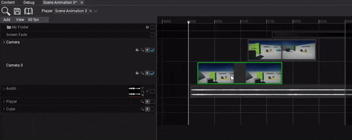
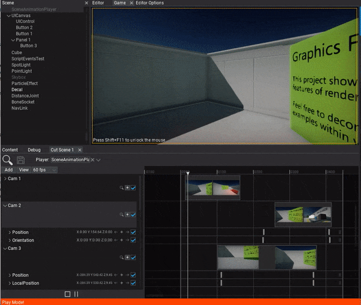

# HOWTO: Make a cut-scene

In the following tutorial, you will learn how to cretae a cut-scene. To learn how to create scene animation see this [page](../scene-animation.md).

## Tutorial

### 1. Add camera shots tracks

Start by simply using drag and drop to add a cut-scene camera into the tracks panel.

### 2. Adjusts the shots media

Now you can drag the timeline media events for every shot. By dragging with a left-mouse button you can move the event and by pressing on its right edge you can change its duration. For more precise editing you can right-click on it and edit media properties.

### 3. Setup camera animations

The next step is to setup the camera animations. You can use **+** button to add subtasks to animate camera position and orientation but it's definitely easier to use **pilot actor tool**. To do so simply navigate the current time position to a time where you want to insert a keyframe and click the **camera icon** on the camera track header. Then you will be able to use the scene editing viewport and pilot the camera. This allows to setup the camera position and direction for this shot. Then press the viewport widget button to end actor piloting and click the **+** buttons on *Position* and *Orientation* tracks to insert keyframes there.

### 4. Play the animation

The final step is to add Scene Animation Player actor and play this animation.

