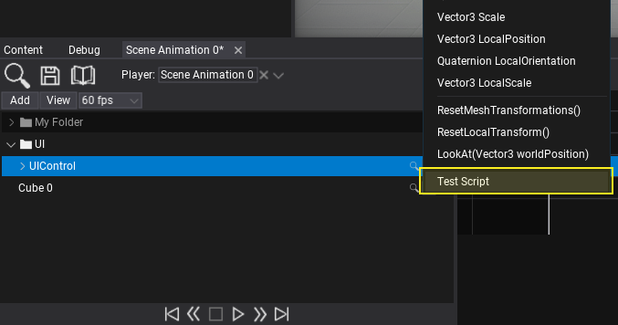
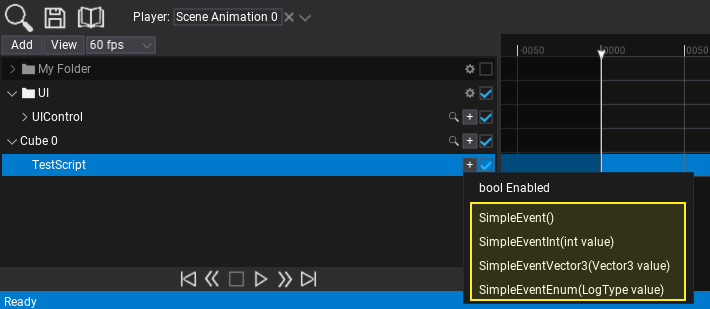
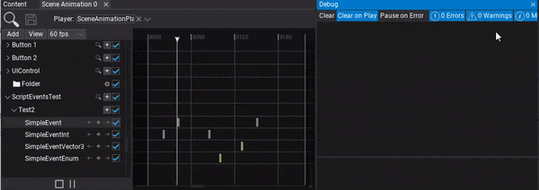

# HOWTO: Use Event Track

In the following tutorial, you will learn how to add event track and call it in timeline. To learn how to create scene animation see this [page](../scene-animation.md).

Scene Animations support calling custom C# methods using a dedicated event track. This allows to invoke any public method from the animated object (actor, script or nested object). Method to invoke has to be `void` and can use up to *8* parameters (value types only).

## Tutorial

### 1. Create scene animation

Also preapre the script with the events you want to call.
Example:

```cs
public class TestScript : Script
{
    public void SimpleEvent()
    {
        Debug.Log("SimpleEvent");
    }

    public void SimpleEventInt(int value)
    {
        Debug.Log("SimpleEventInt: " + value);
    }

    public void SimpleEventVector3(Vector3 value)
    {
        Debug.Log("SimpleEventVector3: " + value);
    }

    public void SimpleEventEnum(LogType value)
    {
        Debug.Log("SimpleEventEnum: " + value);
    }
}
```

### 2. Add actor track

You can drag and drop the actor into the tracks panel or use button Add -> Actor to create new track and pick the actor to animate it.


### 3. Add Script subtrack

Use the **+** button and pick the Script subtrack to call its method. You can also invoke the actor methods itself.



### 3. Add subtrack

Use the **+** button and pick the script method to invoke.



### 4. Add events

Now you can insert keyframes to the event track. To do so use the **+** button as shown in the picture below. You can also use right-click to open the context menu and choose **Add keyframe** option. Each keyframe contains a method parameters data and represents a moment in time to call the event every time playback passes the keyframe time position. To edit parameter simply double-click on a keyframe.

### 5. Play the animation

The final step is to add Scene Animation Player actor and play this animation.


