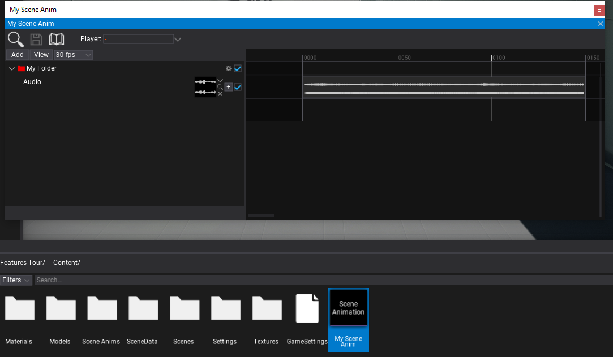

# HOWTO: Create Scene Animation From Code

In the following tutorial, you will learn how to create scene animation asset from C# script. To learn how to create scene animation see this [page](../scene-animation.md).

This code works only in Editor and is intended to be used by game tools code such or editor plugins to generate cut-scenes or dialog sequences. It can be used to automate dialogs/cut-scenes development.

## Tutorial

### 1. Create script that generates the scene animation

```cs
using System.IO;
using FlaxEditor;
using FlaxEditor.GUI.Timeline;
using FlaxEditor.GUI.Timeline.Tracks;
using FlaxEngine;

public class TestScript : Script
{
    public AudioClip Audio;

    public override void OnStart()
    {
#if FLAX_EDITOR
        // Create timeline from code
        var timeline = new SceneAnimationTimeline();

        // Add folder track
        var folderTrack = (FolderTrack) timeline.AddTrack(FolderTrack.GetArchetype());
        folderTrack.Color = Color.Red;
        folderTrack.Rename("My Folder");

        // Add audio track
        var audioTrack = (AudioTrack) timeline.AddTrack(AudioTrack.GetArchetype());
        audioTrack.Asset = Audio;
        audioTrack.ParentTrack = folderTrack;

        // Serialize timeline data to bytes
        var data = timeline.Save();

        // Save data to asset file
        var path = Path.Combine(Globals.ProjectContentFolder, "My Scene Anim.flax");
        Editor.CreateAsset(Editor.NewAssetType.SceneAnimation, path);
        var sceneAnimation = Content.Load<SceneAnimation>(path);
        sceneAnimation.SaveTimeline(data);

        // now use created sceneAnimation..
#endif
    }
}
```

### 2. Add script and run it

Add script to actor and play. You can use this code in [editor plugin](../../../scripting/plugins/index.md) or [custom editor window](../../../scripting/tutorials/custom-window.md).

### 3. See the results

Now there should be `My Scene Anim` asset in your game Content folder. Open it and see the created scene animation.


