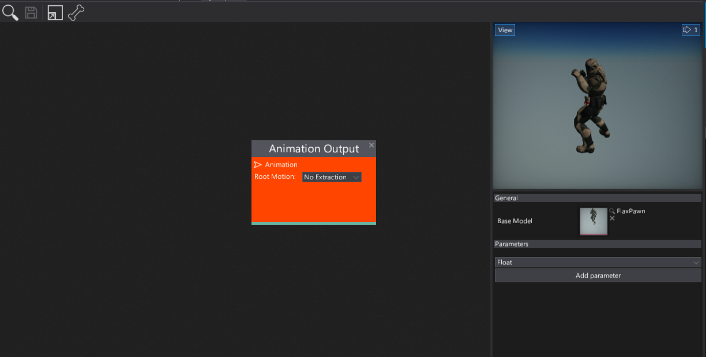
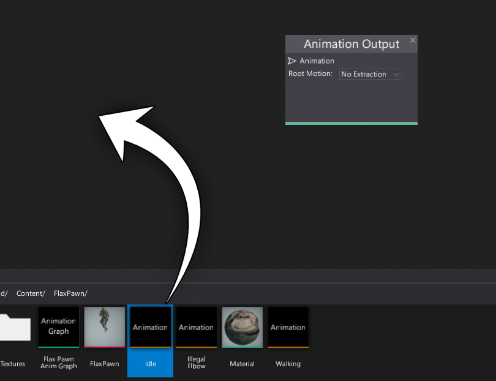
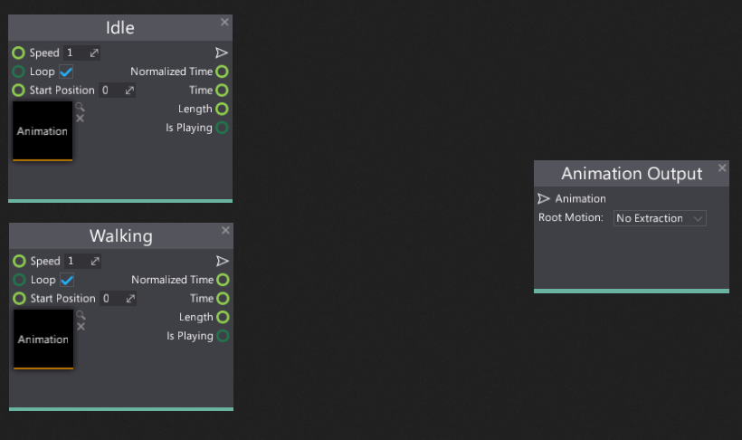
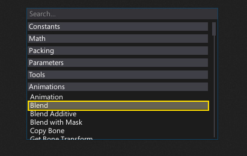
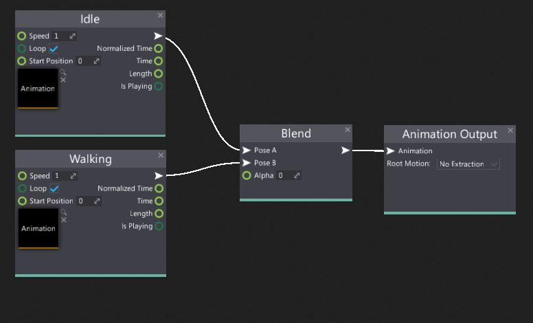
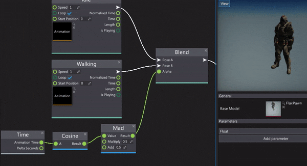

# HOWTO: Blend two animations

In this tutorial you will learn how to quickly blend two animations using the Anim Graph.

## 1. Open Anim Graph

Firstly you need to create and open the Anim Graph editor window.
You can follow the tutorial [How to create Anim Graph](create-anim-graph.md) to learn about it.
Then open the window. Remember to set up the **Base Model** to a target skinned model asset. It's required because it contains the reference skeleton data used in the animation graph evaluation.

## 2. Add animation nodes

Next step is to specify the two animations that you want to blend.
To add them to the group you can drag and drop the assets or use the **Animation** node as shown in the picture below.

As a result, you should have the two animation nodes side by side.

## 3. Add blend node

Now you need to add **Blend** node. To do it simply **right-click** on a surface and select it from the **Animations** group or use the search box.

Also as you can see there are more blend nodes: Blend Additive and Blend with Mask which is also useful when creating more advanced animated model setups.

After adding the blend node you can see that it takes three inputs:
* *Pose A* - the first pose to blend (used when Alpha equals 0)
* *Pose B* - The second pose to blend (used when Alpha equals 1)
* *Alpha* - the linear blending weight (normalized to range 0-1).

You should connect Pose A and B inputs with the animation sample nodes created in the previous step.
Also, connect the blend node output to the final **Animation Output** node.
Now you should see the first animation being played because the default alpha value is 0 so it takes the full animation from the first input.

## 4. See the results

Finally, you can manually change the **Alpha** value, feed it with the graph parameter or use for instance, time based solution. To learn how to do it see [this tutorial](change-anim-graph-param.md).

