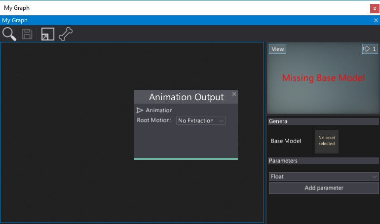
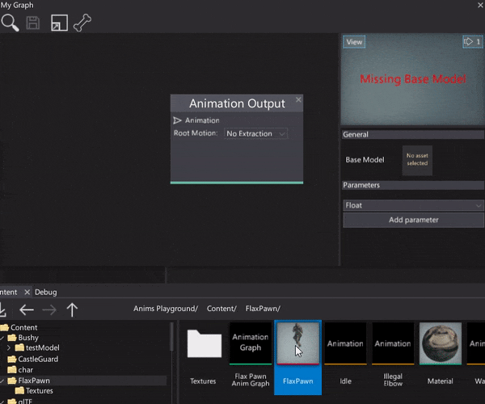
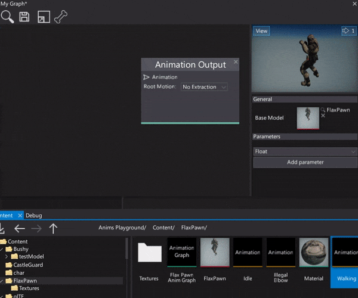

# HOWTO: Create Anim Graph

In this tutorial you will learn how to quickly create a new [Anim Graph](../anim-graph/index.md) asset and setup it to play a single looped animation.

## 1. Create Anim Graph

Use the *Content* window to create a new Anim Graph asset. Right-click and select option **New -> Animation Graph**. Specify its name and hit Enter to confirm.

## 2. Open Anim Graph window

Next step is to double-click on the created asset to see the dedicated editor window. To learn more about is interface see the dedicated page [Anim Graph Window Interface](../anim-graph/interface.md).

## 3. Set the Base Model

Anim Graph asset needs the **Base Model** property to be set in order to evaluate the skeleton nodes animation pose. This Base Model is a reference to the [skinned model](../skinned-model/index.md) asset that contains a valid bones skeleton data. To do it simply drag and drop the target model into the asset picker control.

## 4. Add animation

Now you need to add the animation sampling node which will feed the graph with the animation to playback.
There are several ways to do it. You can right-click and choose the Animation node and pick the asset or **drag and drop the animation** into the surface. It will automatically create the valid node that can be used to play the animation.

## 5. See the results

The final step is to connect the animation node with the Anim Grap output node. Then you can see your animation being played. To learn how to use it in a game see the next tutorial: [How to use Anim Graph](use-anim-graph.md).

