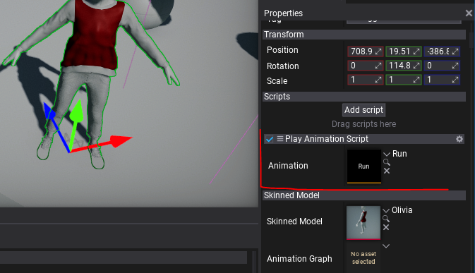

# HOWTO: Play animation from code

In this tutorial, you will learn how to create a virtual Anim Graph that plays a single animation on a Skinned Model.

## 1. Create a script

Firstly you will need to create a new script that will create new virtual Anim Graph asset and set it to the Animated Model instance to play. Use the following example code:

```cs
public class PlayAnimationScript : Script
{
    private AnimationGraph _graph;

    /// <summary>
    /// The animation to play.
    /// </summary>
    public Animation Animation;

    /// <inheritdoc />
    public override void OnStart()
    {
        var animatedModel = Actor.As<AnimatedModel>();
        _graph = Content.CreateVirtualAsset<AnimationGraph>();
        _graph.InitAsAnimation(animatedModel.SkinnedModel, Animation);
        animatedModel.AnimationGraph = _graph;
    }

    /// <inheritdoc />
    public override void OnDestroy()
    {
        // Ensure to cleanup created resources
        Object.Destroy(ref _graph);
    }
}
```

## 2. Add script and setup Animation

The next step is to add this script to the Animated Model on a scene that has valid `Skinned Model` assigned. Then assign `Animation` property to animation you want to play.



## 3. Test it out!

The final step is to test it in game. Simply press *Play* on toolbar or hit *F5* button and see model playing animation. In case of issues open *Output Log* to find any warning or error messages.
