# HOWTO: Setup state machine

In this tutorial, you will learn how to create and use the State Machine inside the Anim Graph to switch between different animations based on input parameters.

## 1. Prepare Anim Graph and assets

Firstly you will need to prepare your animations and skinned model. Then create an Anim Graph that will be used to setup the state machine. You can follow [this tutorial](create-anim-graph.md) to learn how to do it.

## 2. Add **State Machine** node

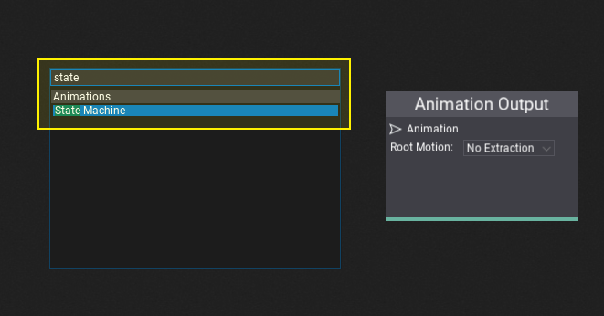

**Right-click** over the surface and type **State Machine** and hit enter or select that node from the hierarchy to spawn it. Then you can specify its name. The default *Locomotion* name should fit most of the use cases so just hit *Enter*. Then connect it with the *Anim Graph* output node as shown in the picture below.

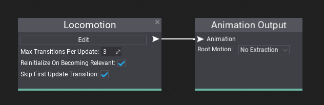

>[!Note]
>You can rename state machine node by using *double-click* over the node header.

## 3. Open State Machine graph

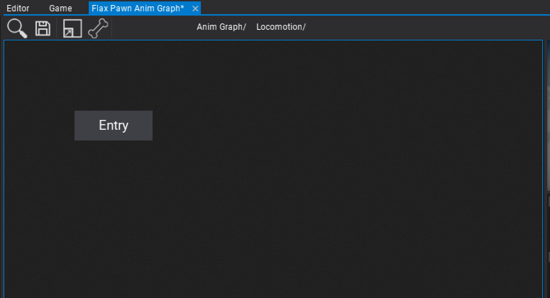

Next step is to open the state machine graph to modify it. Just press the **Edit** button located below the node title.
Each state machine contains a nested graph of states and transitions. You can see the navigation bar on window toolstrip that allows you to move back to the surface by pressing *Anim Graph/* button. During editing states and transitions this comes handly when moving around the graphs.

After opening the graph it contains a default **Entry** node which is used to point the default state of the state machine. The one that is assigned after state machine initialization (eg. Idle).

## 4. Add states

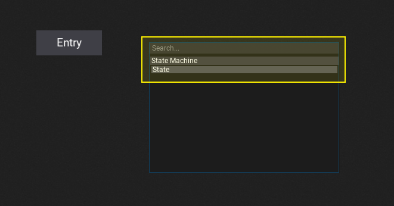

Now, use *right-click* menu to add new states to your state machine. Each state can have own name. After adding states you can move them around by pressing and dragging them over the title. Cross button removes states and tool button allows renaming state after creation.

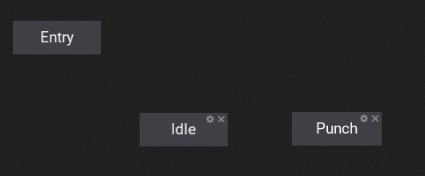

## 5. Create transitions

By pressing left mouse button over the edge of the state or entry node and dragging the mouse you can create transitions. This works the same as connecting surface boxes. Connect your states and add the output from the entry node to prepare the state machine. We will adjust the transitions to implement a correct behavior for this state machine flow.

>[!Note]
>You can press **middle mouse button** to **remove transitions** or *right-click* to use a context menu. Just click over the transition line (it highlights).

## 6. Setup state animations

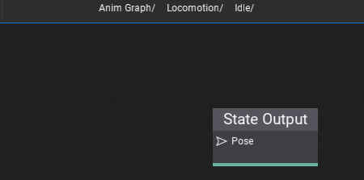

Every state can define custom animation pose sampling. This includes single animation playback or more advances use cases like multi blend using special nodes. To edit state simply **double click** on it. It will open the sub-graph that allows defining the animation output. It works similar to the master output node of the Anim Graph except it's only used when the state is in use.

In this example, we simply sample the **Idle** and **Punch** animations.

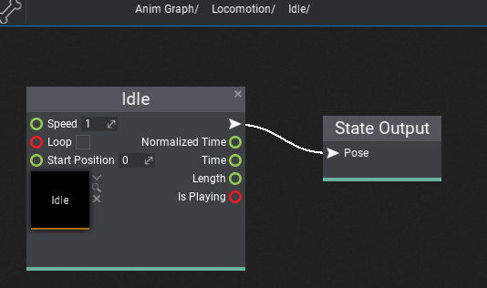

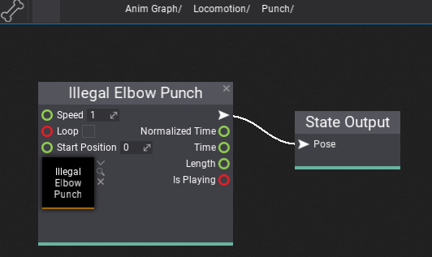

## 7. Add parameters

To control state machine logic flow you will need to define the transition rules. Each transition can be triggered under certain circumstances that you can define. For instance, when a player is falling then you can detect this fact in your script and pass the variable to the Anim Graph parameter that will trigger a transition to Falling state and play the proper animation of the player falling down. To learn how to create Anim Graph parameters see [this tutorial](change-anim-graph-param.md).

In this example, we use **Is Punching** parameter to toggle between *Idle* and *Punch* states.

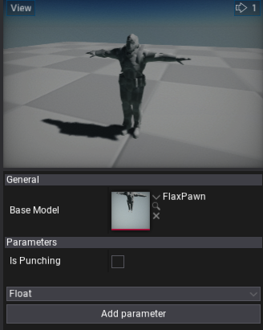

## 8. Setup transition rules

The last step is to use the input parameter to define the state transition rules. To edit transition you can **left-click** over it. Then the properties panel will pop up.

Each transition has a set of various properties that you can define. Disabled transitions are gray-out in the editor to help you guide. You can also adjust the transition time and blending mode. Option **Use Default Rule** can be used to fire the automatic transition when the state animation is about to end. This is useful when creating single-shot states without manually creating a rule.

To edit state transition rule trigger logic use **Edit Rule** button or **double-click** on it (on connection line).
Then the transition graph will show. Again, it works like a State Machine graph. This sub-graph contains a single output node that samples the boolean value which determinates whenever trigger the transition.

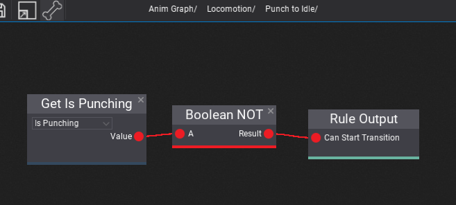

In this example, we define two transitions: one from Idle to Punch, and other from Punch to Idle. Both are using the *Is Punching* variable but in an opposite way (as a toggle). You an use various comparision nodes and math nodes to define various types of transition rules.

Also, remember about using special **Transition Source State Anim** node that can be added to the transition graph to access the source state animation playback information. It can be used to trigger the animation in a specific moment, for instance when the source state animation is about to end.

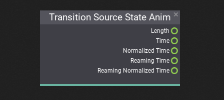

## 9. Test it out!

The final step is to test the state machine behavior in the live action. You can drive the parameters from code or try editing parameters values to see the preview.

