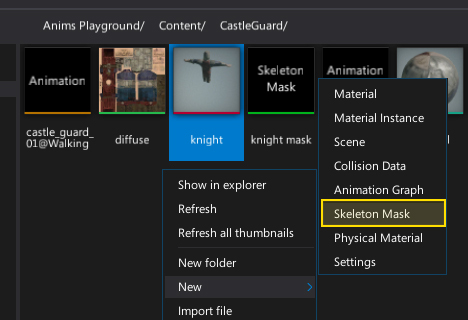
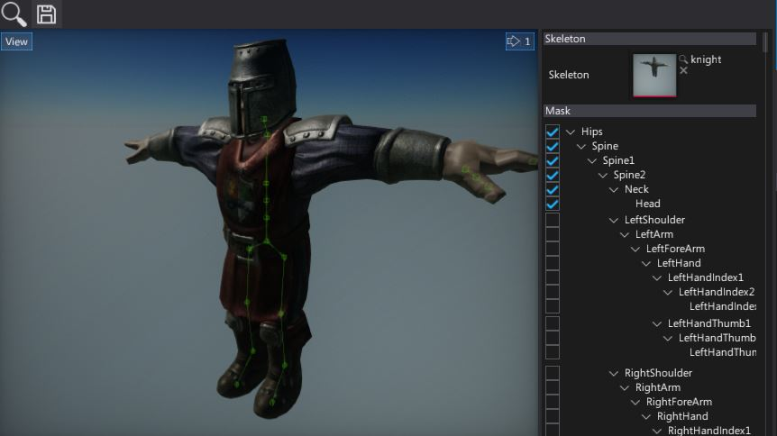
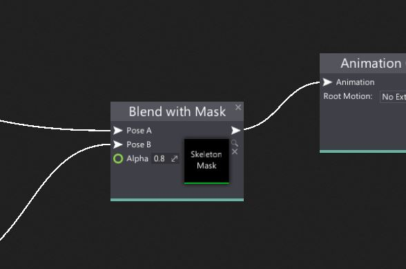

# HOWTO: Use Skeleton Mask

In the following tutorial, you will learn how to create and use a skeleton mask asset.

1. To create a new skeleton mask asset, simply navigate to the Content directory in the *Content* window, then right-click and choose option **New -> Animartion -> Skeleton Mask**. Specify its name and press *Enter*.

	

2. Double-click on a created asset. Asset editor window will show up. Then drag-and-drop the target skinned model to use its skeleton as a reference for the mask. After that, you can use the checkboxes in the bones structure to edit the bones mask. Not that in the preview panel you can see the selected bones structure.

	

3. Next step is to use it directly in the Anim Graph. To do so add new **Blend with Mask** or drag and drop the asset into the surface. Then connect the poses and set up the blending.

	
