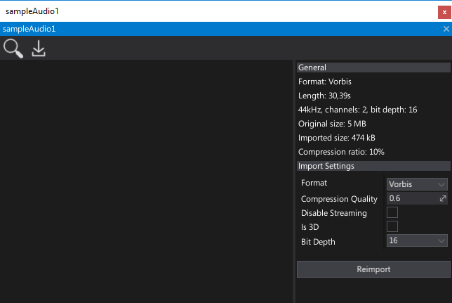
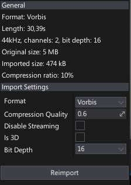

# Audio Clip

**Audio Clip** is an binary asset that contains an audio data.
It supports dynamic data streaming and decompression.
All imported audio resources are stored using Audio Clips.

## Window

**Audio Clip Window** is the main tool to preview and reimport audio assets. To show it simply double-click on an audio clip in a Content window.

### Properties panel

This panel shows audio clip properties.

- **General** group contains information about audio data format, size and memory usage.
- **Import Settings** group contains audio import options (restored from last import). You can modify them and press **Reimport** button to update the asset from the source audio file

To learn more about audio import options see dedicated [Audio Import Settings](importing.md) page.

