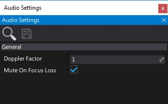

# Audio Settings

Audio settings asset specifies the audio playback options.

## Properties

| Property | Description |
|--------|--------|
| **Doppler Factor**  | The doppler doppler effect factor. Scale for source and listener velocities. Default is 1. |
| **Mute On Focus Loss**  | If checked, engine will mute all audio playback when game has no use focus. |
