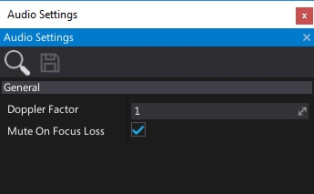

# Audio Settings

Audio settings asset specifies the audio playback options.

## Properties

| Property | Description |
|--------|--------|
| **Disable Audio**  | If checked, audio playback will be disabled in build game. Can be used if game uses custom audio playback engine. |
| **Doppler Factor**  | The doppler doppler effect factor. Scale for source and listener velocities. Default is 1. |
| **Mute On Focus Loss**  | If checked, engine will mute all audio playback when game has no use focus. |
| **Enable HRTF** | Enables or disables HRTF audio for in-engine processing of 3D audio (if supported by platform). If enabled, the user should be using two-channel/headphones audio output and have all other surround virtualization disabled (Atmos, DTS:X, vendor specific, etc.) |
