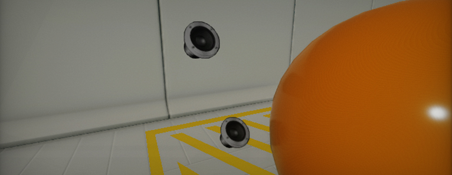
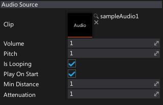

# Audio Source

**Audio Source** is an actor type that represents a source for emitting audio. Audio can be played spatially (gun shot), or normally (music). Each audio source must have an [Audio Clip](audio-clip.md) to play - back, and it can also have a position in the case of spatial (3D) audio.

Whether or not an audio source is spatial is controlled by the assigned AudioClip. The volume and the pitch of a spatial audio source is controlled by its position and the [Audio Listener](audio-listener.md)'s position/direction/velocity.

## Properties

| Property | Description |
|--------|--------|
| **Clip** | The audio clip asset used as a source of the sound. |
| **Volume** | The volume of the audio played from this source, in [0, 1] range. |
| **Pitch** | The pitch of the played audio. The default is 1. |
| **Is Looping** | Determines whether the audio clip should loop when it finishes playing. |
| **Play On Start** | Determines whether the audio clip should auto play on level start. |
| **Min Distance** | The minimum distance at which audio attenuation starts. When the listener is closer to the source than this value, audio is heard at full volume. Once farther away the audio starts attenuating. |
| **Attenuation** | The attenuation that controls how quickly does audio volume drop off as the listener moves further from the source. |

