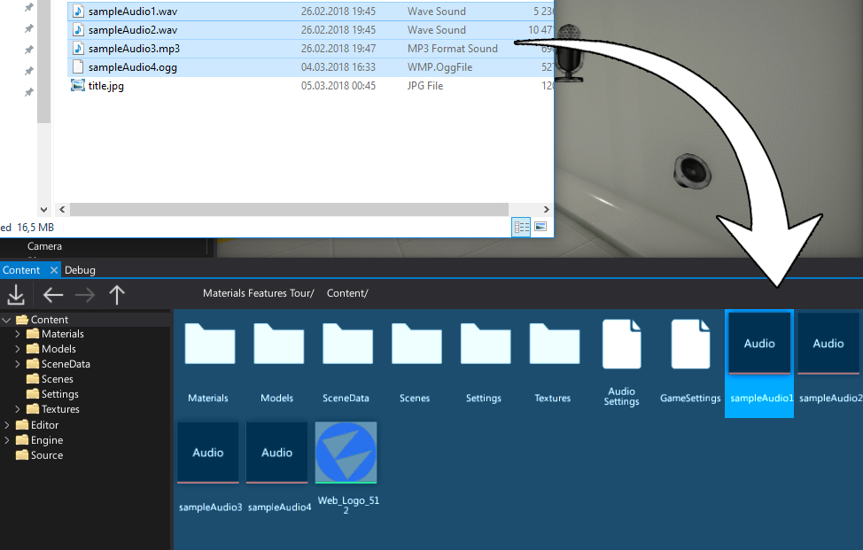
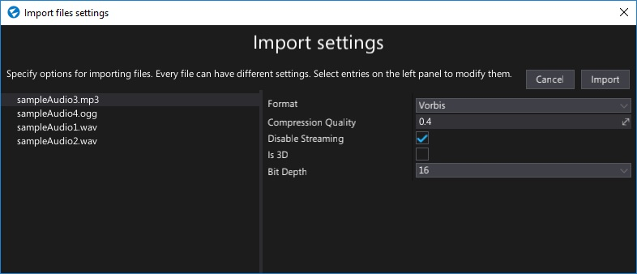
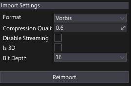

# Importing audio

You can import audio files to use as sound assets in your project.
Flax Engine supports importing the following list of file types as audio clips:
* `.mp3`
* `.wav`
* `.ogg`

## Importing a sound

The easiest way to import one or more textures is to drag them from *Explorer* to the *Content* window.

Alternatively, you can use **Import** button in a *Content* window toolbar and then select files to import.

After choosing the files **Import file settings** dialog shows up. It's used to specify import options per asset. In most cases the default values are fine and you can just press the **Import** button.

> [!Note]
> Using **Import file settings** dialog you can select more than one resource at once (or use **Ctrl+A** to select all) and specify import options at once.

## Import settings

| Property | Description |
|--------|--------|
| **Format** | Specifies the audio data format to import the audio clip as. You may want to use optimzied and compressed formats or raw PCM data for the best quality. In most cases you want to use the Vorbis compressed format, in order to save on memory use. Possible options: <table><tbody><tr><th>Option</th><th>Description</th></tr><tr><td>**Raw**</td><td>This is raw uncompressed audio data stored in pulse-code modulation format.</td></tr><tr><td>**Vorbis**</td><td>The compressed audio data stored in the Vorbis format.</td></tr></tbody></table>|
| **Compression Quality** | The audio data compression quality. Used only if target format is using compression. Value 0 means the smallest size, value 1 means the best quality. |
| **Disable Streaming** | If checked, disables dynamic audio streaming. The whole clip will be loaded into the memory. Useful for small clips (eg. gunfire sounds) or if audio streaming provides too much lag when starting to play the clip. |
| **Is 3D** | If checked, the clip be played as spatial (3D) audio or as normal audio. 3D audio is stored in Mono format. |
| **Bit Depth** | The size of a single sample in bits. The clip will be converted to this bit depth on import. Possible options:  **8**, **16**, **24**, **32**. The default is 16. |

