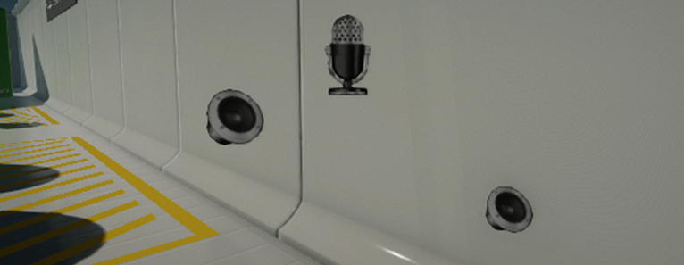

# Audio

Flax supports importing **audio clips** into your project and using them in a game.
You can import short sound effects, as well as, voice-overs and soundtracks.
Flax supports audio features including 3D spatialized audio, compression, streaming, and low-latency playback.

## In this section

* [Importing audio](importing.md)
* [Using audio](using.md)
* [Audio Clip](audio-clip.md)
* [Audio Source](audio-source.md)
* [Audio Listener](audio-listener.md)
* [Audio Settings](audio-settings.md)

