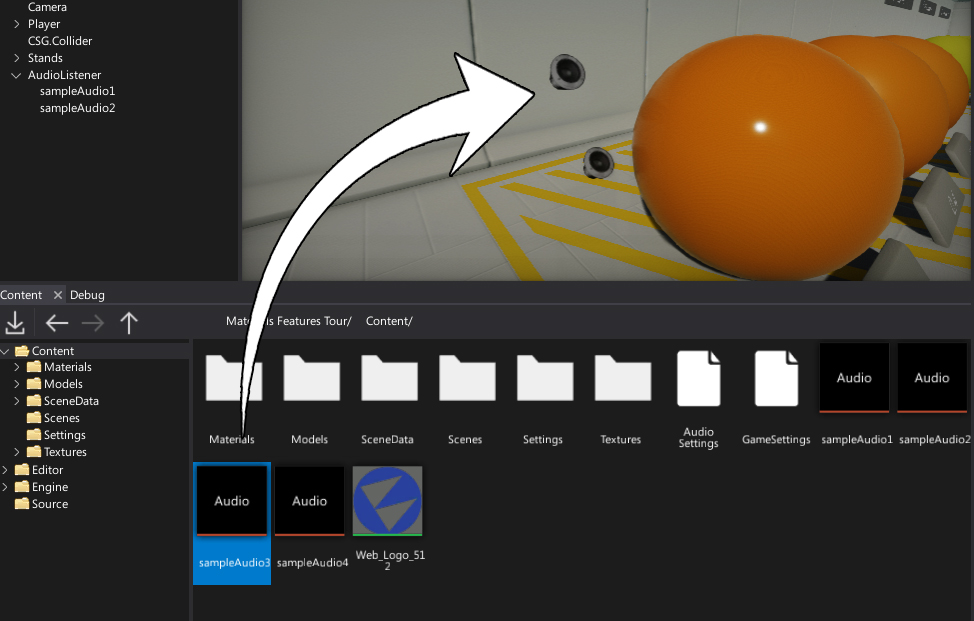

# Using audio

[Audio Clip](audio-clip.md) assets are used by [Audio Sources](audio-source.md) which are used to playback the audio during the gameplay.
To use a sound create new audio source (via toolbox or a scene window context menu) and bind the clip to it or simply drag and drop the audio clip into the viewport.

Next, you can check the **Play On Start** property and source will start playing the sound as soon the game starts.

## Playing audio

The most common way to play/pause/stop the audio sources is by using C# API:
* [AudioSource.Play](https://docs.flaxengine.com/api/FlaxEngine.AudioSource.html#FlaxEngine_AudioSource_Play) - Starts playing the assigned audio clip. If playback is currently stopped it starts playback from the clip beginning. If paused the playback is resumed from the point it was paused.
* [AudioSource.Pause](https://docs.flaxengine.com/api/FlaxEngine.AudioSource.html#FlaxEngine_AudioSource_Pause) - Pauses playing the assigned audio clip, allowing you to later resume it with a call to Play.
* [AudioSource.Stop](https://docs.flaxengine.com/api/FlaxEngine.AudioSource.html#FlaxEngine_AudioSource_Stop) - Stops playing the assigned audio clip.

## Seeking

You can seek to a specific position within the currently assigned audio clip by using property AudioSource.Time. It accepts a time in seconds. If clip is currently playing, the playback will skip to the provided time. If clip is currently paused, the clip will resume from the provided time the next time Play() is called.

## 3D Sounds

If an AudioClip has been marked as 3D sound, then sound playback will be influenced by the position and/or velocity of the scene object the AudioSource component is attached to. This means such sounds will sound differently depending on their distance from the listener (among other properties). This ensures the sounds feel realistic as the player walks around the level (i.e. sounding quieter when far away, or using surround to project the sound behind the player).

3D sounds only work if there is a [listener](audio-listener.md) defined in the scene.

