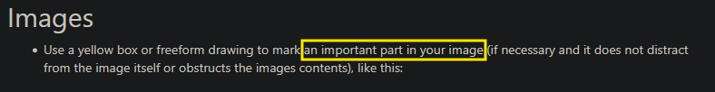

# Flax Engine Documentation Guidelines

This page will list a few guidelines that, if respected while writing documentation, will lead to a more unified, consistent and easy to understand documentation of the Flax Engine.

> [!Note]
> These guidelines are not absolute. Please use your best judgment; if a suggestion feels counterproductive or ill-suited to the specific context of your documentation, feel free to deviate from it. 
>

> [!Note]
> Some parts of the documentation might break from these guidelines, mostly because they have been existing before this was written or because the note above. Feel free to correct those parts or open an issue on GitHub.
>

## Terminology

- The individual, (un-) dockable sections that make up the Flax Editor should be referred to as "*Panel*"s (for example *Content Panel*, *Properties Panel*). If it's nicer to just put the name (like *Toolbox*, *Scene Tree*, *Main 3D Editor*), then that is fine as well.
- Write the following terms in all capital letters:
    - API
    - UI
    - URL
- Spell "Flax Engine" with a capital "F" and "E" 

## Style & Syntax

- Always the following terms in *cursive* (surround it with two `*`):
    - *Actor*
    - *Script*
    - *\* Panel* (eg. *Content Panel*, also includes *Toolbox* etc.)
- Mark terms that are directly related to the topic of the documentation page you are editing as bold (by adding two `**` to them). For example, if you are editing the [Tags](../scripting/advanced/tags.md) manual page, mark these terms as bold like this:
    - **Tag**
    - **Tags**
    - **tag**
    - **tags**

## Code

- Put code code blocks (surround them with two `` ` `` ). 
- *Don't* put common programming terms (eg. "*class*", "*struct*", "*float*") into a code block, unless you deem it absolutely necessary.
- Add a linebreak (` `) after the end (represented by `***`) of a code block table (usually used to give one C# and one C++ example, as seen [here](../scripting/advanced/tags.md/#code-example)) if it is directly followed by another text paragraph.

## Links

- If you mention a class, property or really anything that is part of the [Flax API documentation](https://docs.flaxengine.com/api/index.html), add a hyperlink to it that links to the API reference page, like this: [`IsFlaxEngineTheBest`](https://docs.flaxengine.com/api/FlaxEditor.Editor.html#FlaxEditor_Editor_IsFlaxEngineTheBest).  Make sure you link to the exact section/ heading, not just the general page. 
- If you are mentioning a different section of the documentation, for example: "(*as seen in the*) *[Tags](../scripting/advanced/tags.md)* (*manual page*)", make sure to link to it via the markdown file and heading (*not* via an URL).  *Good example:* [Tags](../scripting/advanced/tags.md) *Bad Example: [Tags](https://docs.flaxengine.com/manual/scripting/advanced/tags.html)*  The good example links to the markdown file: `[Tags](../scripting/advanced/tags.md)`, while the bad example links to an URL: `[Tags](https://docs.flaxengine.com/manual/scripting/advanced/tags.html)`.
    
You can add a link by doing `[text](link)`.

## Images
- Use a yellow box or freeform drawing to mark an important part in your image (if necessary and it does not distract from the image itself or obstructs the images contents), like this:

## Accessibility

- Always add an *alt text* that is descriptive enough to your images. The alt text is the text in the `[]` of your markdown image embed