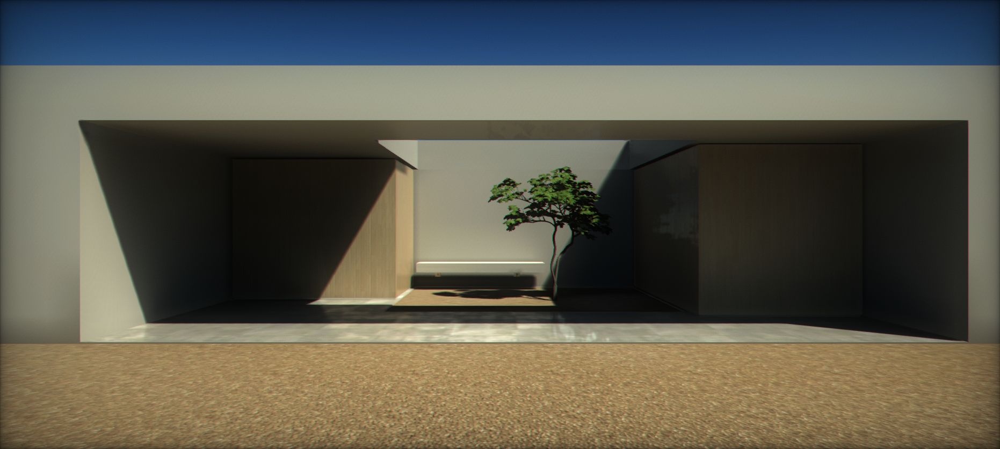
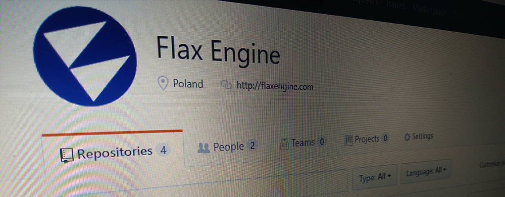

# Let's make game engines great again!

We always welcome collaborative participation and community development.
We believe that open projects have huge potential and provide many opportunities to develop better software.

Check out the official repositories on a GitHub:

* [https://github.com/FlaxEngine](https://github.com/FlaxEngine)

## In this section

* [Feature Requests](feature-requests.md)
* [Report a bug](report-a-bug.md)
* [Release Policy](release-policy.md)
* [Public Projects](public-projects.md)

## Open Source

### Flax Engine

The main repository [Flax Engine](https://github.com/FlaxEngine/FlaxEngine) contains full source code of the Flax Engine and Flax Editor with all tools and platforms. You can fork it and edit whatever you need. A modified Engine and/or Editor can be used in Flax games production so it can be very handy to have more control over the engine. Also, any pull requests are welcome.

The repository available on GitHub is a mirror of our internal Git repository hosted on [https://gitlab.flaxengine.com/flax/flaxengine](https://gitlab.flaxengine.com/flax/flaxengine) (mirror updated every 5 minutes). We use our internal LFS server for large binary file hosting. The repository contains an `.lfsconfig` file for LFS to work properly but if you encounter issues when pushing changes on your fork try using `git push --no-verify` or migrate to your own LFS server.

If you want to open the Flax Engine in Visual Studio you might need to install the [Flax Engine Tools for Visual Studio](https://marketplace.visualstudio.com/items?itemName=Flax.FlaxVS) extension (Not needed for Version 1.6 and higher).

### Flax Docs

The documentation you're reading right now is hosted as an open project on GitHub [here](https://github.com/FlaxEngine/FlaxDocs). You can fork the repository and edit it to contribute to the project or report issues there.
