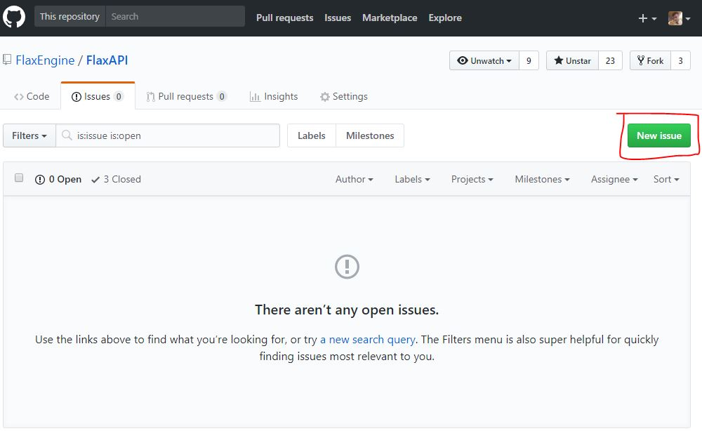
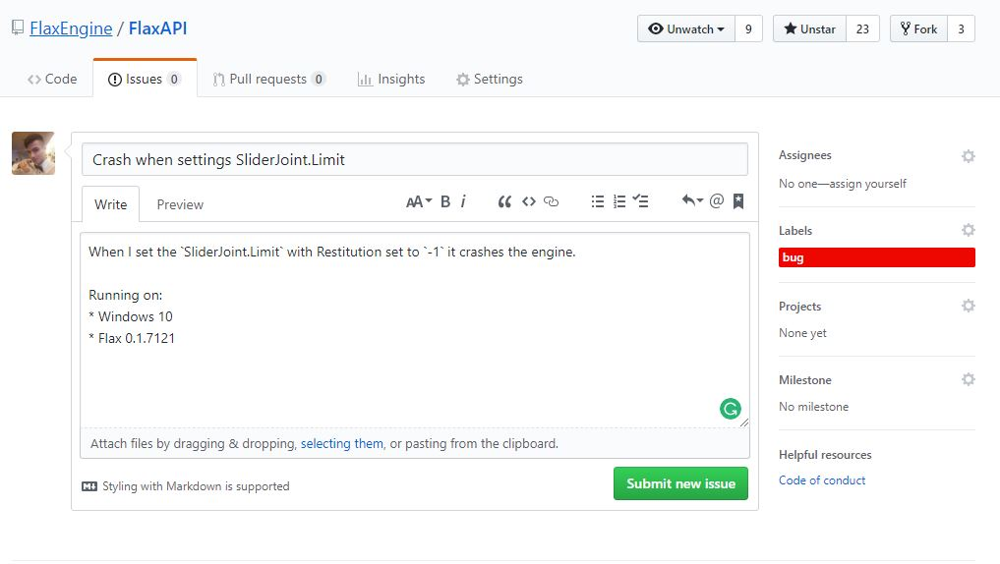

# Report a bug

If you encounter an issue or any bug in Flax Engine or Flax Editor you can report it to the Flax Team. As soon as we will be able to reproduce it we will fix it.

## 1. Navigate to Flax Engine issues

Navigate to the [https://github.com/FlaxEngine/FlaxEngine/issues](https://github.com/FlaxEngine/FlaxEngine/issues) page and press the **New issue** button.

## 2. Describe the issue and submit

Fill in the issue form. Specify a proper title and add a detailed description. You can add labels to the issue so it's easier to identify. Then press the **Submit new issue** button.

## 3. Wait for help

After you create a new issue someone from the Flax Team will review it and try to help you. In most cases, you will get an answer within a few hours.

Thanks for your help! :)

