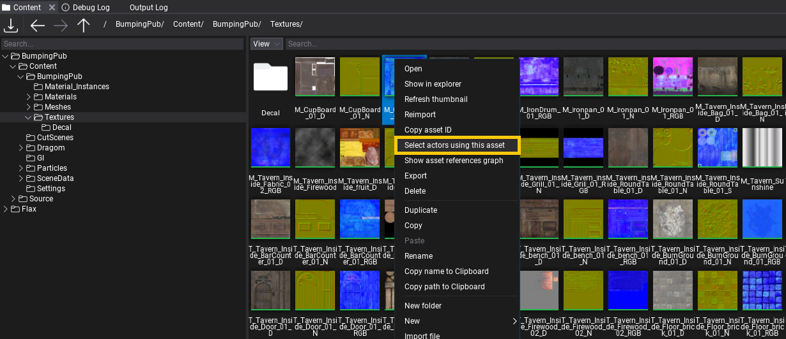
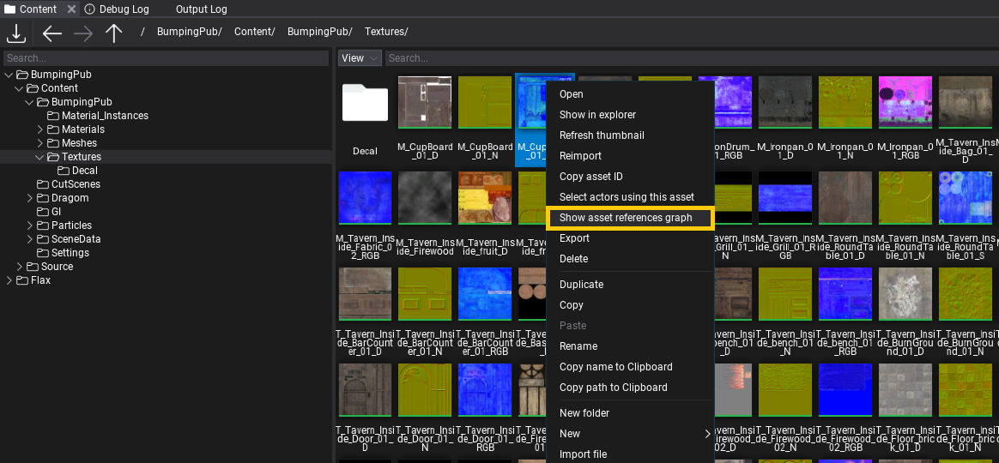

# Asset References

Editor contains various tools to help developers when working in large projects. This documentation page explains the basic usage of those utilities.

## Actors using asset

In *Content* window, *right-click* on an asset and select **Select actors using this asset** option. Editor will iterate over all loaded scenes and actors to search for usage of the selected asset. Then all actors using it will be selected (or none if no usage found). This feature can be useful when analyzing usage of a specific asset on a map (eg. model, texture, sfx, vfx, etc.).

## Asset references graph

In *Content* window, *right-click* on an asset and select **Show asset references graph** option. It will open a window with a graph containing visual representation of assets that reference this asset and assets references by this asset. The graph deep level is constrained to 4 and it doesn't diplsay duplicates (ie. if asset A references B and C but B references C too, then C won't be displayed 2nd time).

![Asset References Graph]

> [!NOTE]
> Searching for asset references can be a slow process if project is large or is located on HDD drive so be patient (loading progress is displayed in percentage).

## Scripting

In Editor, scripts can access the list of assets references by the given asset by using `GetReferences()`. One special case, for C# are Scene Assets that have the same ID as Scene object so to get scene references use `GetAssetReferences` on opened scene.
