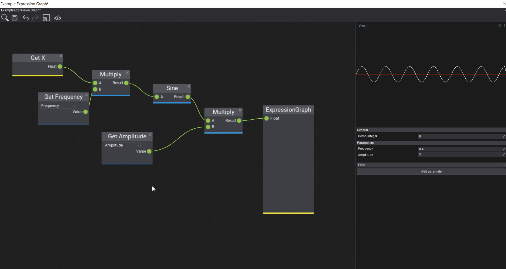
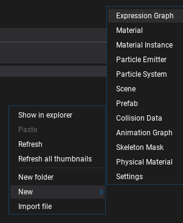
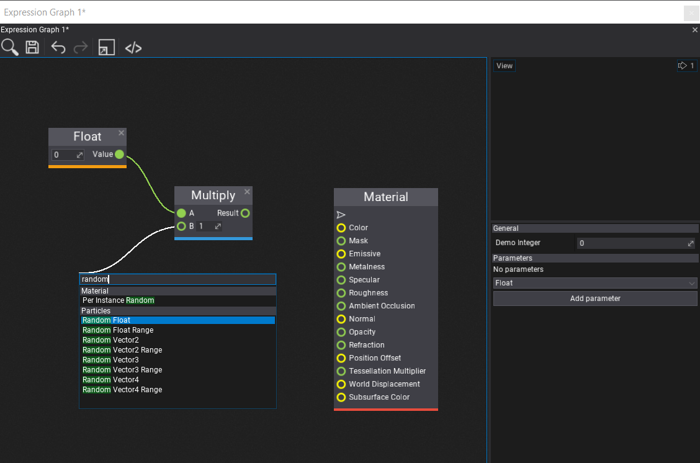
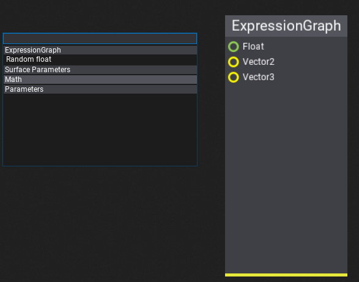
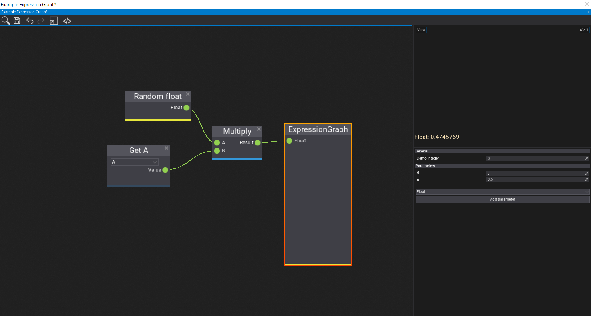
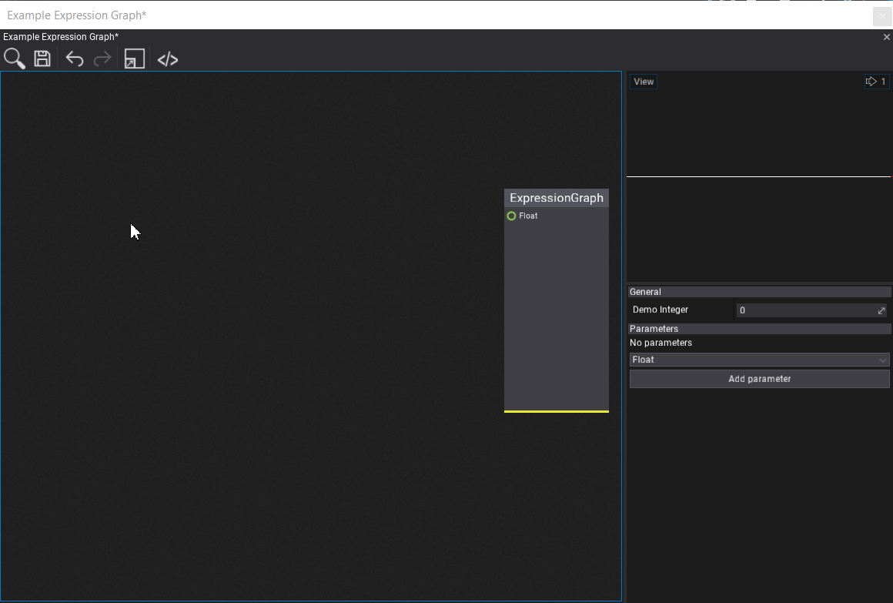

# Custom Visject Surfaces

The Flax Engine has a visual scripting language called Visject. It's used by [Materials](./../../graphics/materials/material-editor/index.md), [Particles](./../../particles/particle-emitter.md), and [Animations](./../../animation/anim-graph/index.md). It offers a wide range of features to be used by content creation tools.

You can also use it for your own purposes which can range from a simple graphing plugin to a full-blown scripting system.

These tutorials will go over the process of creating your own Visject surface for an expression graph. Something very simple that takes a few numbers, performs a few calculations and outputs a number. It is recommended to first check out the [custom plugin tutorials](./../../scripting/plugins/index.md).



## Asset

The first step is creating our own asset type. This asset type needs a `byte[]` to save the Visject surface.

It also needs a version of the graph that you can execute in a built game. This part will be covered in a later tutorial.

```cs
public class ExpressionGraph
{
    /// <summary>
    /// Serialized Visject surface
    /// </summary>
    public byte[] VisjectSurface { get; set; }

    // TODO: Stuff that you can execute in a built game
}
```

This asset type will be a [json asset](https://docs.flaxengine.com/api/FlaxEngine.JsonAsset.html).

## Asset Proxy

To create and open assets using the Flax Editor, an [asset proxy](https://docs.flaxengine.com/api/FlaxEditor.Content.AssetProxy.html) is required. Since it's an editor file, it needs to be in the editor assembly. To do so, create a new folder called `Editor`. In this folder, create a new asset proxy.

```cs
public class ExpressionGraphProxy : JsonAssetProxy
{
    /// <inheritdoc />
    public override string Name => "Expression Graph";

    /// <inheritdoc />
    // This will be implemented in the next step...
    //public override EditorWindow Open(FlaxEditor.Editor editor, ContentItem item)
    //{
    //    return new ExpressionGraphWindow(editor, (JsonAssetItem)item);
    //}

    /// <inheritdoc />
    public override Color AccentColor => Color.FromRGB(0x0F0371);

    /// <inheritdoc />
    public override string TypeName { get; } = typeof(ExpressionGraph).FullName;

    /// <inheritdoc />
    public override bool CanCreate(ContentFolder targetLocation)
    {
        return targetLocation.CanHaveAssets;
    }

    /// <inheritdoc />
    public override void Create(string outputPath, object arg)
    {
        FlaxEditor.Editor.SaveJsonAsset(outputPath, new ExpressionGraph());
    }
}
```

### Register the proxy

Then, we have to use an editor [plugin](./../../scripting/plugins/index.md) to register the proxy.

> [!NOTE]
> Make sure to add it *before* the `GenericJsonAssetProxy`, which is the last proxy in the list and is used as a fallback proxy.

```cs
public class ExpressionGraphPlugin : EditorPlugin
{
    private ExpressionGraphProxy _expressionGraphProxy;

    /// <inheritdoc />
    public override void InitializeEditor()
    {
        base.InitializeEditor();

        _expressionGraphProxy = new ExpressionGraphProxy();

        // Register the proxy
        Editor.ContentDatabase.Proxy.Insert(0, _expressionGraphProxy);
    }

    /// <inheritdoc />
    public override void Deinitialize()
    {
    	// Cleanup on plugin deinit
        Editor.ContentDatabase.Proxy.Remove(_expressionGraphProxy);

        base.Deinitialize();
    }
}
```

Once this is done, you should be able to create a new expression graph asset in your `Content` folder.



## Visject Window

Opening the expression graph is currently rather disappointing. So, in this step, we'll create our own window with a Visject surface for it. Such a window has an asset, a temporary copy of the asset, a number of parameters, a surface and a live-preview.

### Basic Implementation

To do so, we create a file in the `Editor` folder that inherits from `VisjectSurfaceWindow`. We'll also need a preview and a surface in the `Editor` folder.

```cs
public class ExpressionGraphPreview : AssetPreview
{
    // Preview will be expanded later
    public ExpressionGraphPreview(bool useWidgets) : base(useWidgets)
    {
    }

    public ExpressionGraph ExpressionGraph { get; set; }
}
```

```cs
public class ExpressionGraphSurface : VisjectSurface
{
    public const int MainNodeGroupId = 1;
    public const int MainNodeTypeId = 1;

    // Surface will be expanded later
    public ExpressionGraphSurface(IVisjectSurfaceOwner owner, Action onSave, FlaxEditor.Undo undo = null, SurfaceStyle style = null, List<GroupArchetype> groups = null)
    : base(owner, onSave, undo, style, groups)
    {
    }
}
```

```cs
public class ExpressionGraphWindow : VisjectSurfaceWindow<JsonAsset, ExpressionGraphSurface, ExpressionGraphPreview>
{
    /// <summary>
    /// The allowed parameter types.
    /// </summary>
    private readonly ScriptType[] _newParameterTypes =
    {
        new ScriptType(typeof(float)),
        new ScriptType(typeof(Vector2)),
        new ScriptType(typeof(Vector3)),
        new ScriptType(typeof(Vector4)),
    };

	/// <summary>
	/// The properties proxy object.
	/// </summary>
	private sealed class PropertiesProxy
	{
		[EditorOrder(1000), EditorDisplay("Parameters"), CustomEditor(typeof(ParametersEditor)), NoSerialize]
		// ReSharper disable once UnusedAutoPropertyAccessor.Local
		public ExpressionGraphWindow Window { get; set; }

		[EditorOrder(20), EditorDisplay("General"), Tooltip("It's for demo purposes")]
		public int DemoInteger { get; set; }

		[HideInEditor, Serialize]
		public List<SurfaceParameter> Parameters
		{
			get => Window.Surface.Parameters;
			set => throw new Exception("No setter.");
		}

		/// <summary>
		/// Gathers parameters from the specified window.
		/// </summary>
		/// <param name="window">The window.</param>
		public void OnLoad(ExpressionGraphWindow window)
		{
			// Link
			Window = window;
		}

		/// <summary>
		/// Clears temporary data.
		/// </summary>
		public void OnClean()
		{
			// Unlink
			Window = null;
		}
	}

	private readonly PropertiesProxy _properties;

	private ExpressionGraph _assetInstance;

	/// <inheritdoc />
	public ExpressionGraphWindow(FlaxEditor.Editor editor, AssetItem item)
	: base(editor, item)
	{
		// Asset preview
		_preview = new ExpressionGraphPreview(true)
		{
			Parent = _split2.Panel1
		};

		// Asset properties proxy
		_properties = new PropertiesProxy();
		_propertiesEditor.Select(_properties);

		// Surface
		_surface = new ExpressionGraphSurface(this, Save, _undo)
		{
			Parent = _split1.Panel1,
			Enabled = false
		};

		// Toolstrip
		_toolstrip.AddSeparator();
		_toolstrip.AddButton(editor.Icons.BracketsSlash32, () => ShowJson(_asset)).LinkTooltip("Show asset contents");
	}

	/// <summary>
	/// Shows the JSON contents window.
	/// </summary>
	/// <param name="asset">The JSON asset.</param>
	public static void ShowJson(JsonAsset asset)
	{
		FlaxEditor.Utilities.Utils.ShowSourceCodeWindow(asset.Data, "Asset JSON");
	}

    /// <inheritdoc />
    public override IEnumerable<ScriptType> NewParameterTypes => _newParameterTypes;

	/// <inheritdoc />
	protected override void UnlinkItem()
	{
    	// Cleanup
		_properties.OnClean();
		_preview.ExpressionGraph = null;

		base.UnlinkItem();
	}

	/// <inheritdoc />
	protected override void OnAssetLinked()
	{
    	// Setup
		_assetInstance = _asset.CreateInstance<ExpressionGraph>();
		_preview.ExpressionGraph = _assetInstance;

		base.OnAssetLinked();
	}

	/// <inheritdoc />
	public override string SurfaceName => "Expression Graph";

	/// <inheritdoc />
	public override byte[] SurfaceData
	{
		get => ExpressionGraphSurface.LoadSurface(_asset, _assetInstance, true);
		set
		{
			// Save data to the temporary asset
			if (ExpressionGraphSurface.SaveSurface(_asset, _assetInstance, value))
			{
				// Error
				_surface.MarkAsEdited();
				Debug.LogError("Failed to save surface data");
			}
			// Optionally reset the preview
		}
	}

	/// <inheritdoc />
	protected override bool LoadSurface()
	{
		// Init asset properties and parameters proxy
		_properties.OnLoad(this);

		// Load surface data from the asset
		byte[] data = ExpressionGraphSurface.LoadSurface(_asset, _assetInstance, true);
		if (data == null)
		{
			// Error
			Debug.LogError("Failed to load expression graph surface data.");
			return true;
		}

		// Load surface graph
		if (_surface.Load(data))
		{
			// Error
			Debug.LogError("Failed to load expression graph surface.");
			return true;
		}

		return false;
	}

	/// <inheritdoc />
	protected override bool SaveSurface()
	{
		// TODO: Graph compilation
		_surface.Save();
		return false;
	}

	/// <inheritdoc />
	public override void SetParameter(int index, object value)
	{
		// TODO: Update the asset value to have nice live preview
		//_assetInstance.Parameters[index].Value = value;

		base.SetParameter(index, value);
	}
}
```

### Saving and Loading

Usually an asset has a `SaveSurface` and a `LoadSurface` method. To implement those methods, we need to call functions from the editor assembly such as `FlaxEditor.Editor.SaveJsonAsset`. However, we can't reference the editor assembly from the game assembly. Thus, we'll put those functions in `ExpressionGraphSurface.cs`.

The surface loading method tried to load the surface from an ExpressionGraph instance. If the surface doesn't exist yet, it creates a new Visject surface context with a main node and returns that.

The surface saving method saves the surface to the asset instance. It then saves the asset instance as json to the hard drive.

```cs
/// <summary>
/// For saving and loading surfaces
/// </summary>
private class FakeSurfaceContext : ISurfaceContext
{
    public string SurfaceName => throw new NotImplementedException();

    public byte[] SurfaceData { get; set; }

    public void OnContextCreated(VisjectSurfaceContext context)
    {

    }
}

/// <summary>
/// Tries to load surface graph from the asset.
/// </summary>
/// <param name="createDefaultIfMissing">True if create default surface if missing, otherwise won't load anything.</param>
/// <returns>Loaded surface bytes or null if cannot load it or it's missing.</returns>
public static byte[] LoadSurface(JsonAsset asset, ExpressionGraph assetInstance, bool createDefaultIfMissing)
{
    if (!asset) throw new ArgumentNullException(nameof(asset));
    if (assetInstance == null) throw new ArgumentNullException(nameof(assetInstance));

    // Return its data
    if (assetInstance.VisjectSurface?.Length > 0)
    {
        return assetInstance.VisjectSurface;
    }

    // Create it if it's missing
    if (createDefaultIfMissing)
    {
        // A bit of a hack
        // Create a Visject Graph with a main node and serialize it!
        var surfaceContext = new VisjectSurfaceContext(null, null, new FakeSurfaceContext());

        // Add the main node
        // TODO: Change NodeFactory.DefaultGroups to your list of group archetypes
        var node = NodeFactory.CreateNode(NodeFactory.DefaultGroups, 1, surfaceContext, MainNodeGroupId, MainNodeTypeId);

        if (node == null)
        {
            Debug.LogWarning("Failed to create main node.");
            return null;
        }
        surfaceContext.Nodes.Add(node);
        node.Location = Vector2.Zero;
        surfaceContext.Save();
        return surfaceContext.Context.SurfaceData;
    }
    else
    {
        return null;
    }
}

/// <summary>
/// Updates the surface graph asset (save new one, discard cached data, reload asset).
/// </summary>
/// <param name="data">Surface data.</param>
/// <returns>True if cannot save it, otherwise false.</returns>
public static bool SaveSurface(JsonAsset asset, ExpressionGraph assetInstance, byte[] surfaceData)
{
    if (!asset) throw new ArgumentNullException(nameof(asset));

    assetInstance.VisjectSurface = surfaceData;

    bool success = FlaxEditor.Editor.SaveJsonAsset(asset.Path, assetInstance);
    asset.Reload();
    return success;
}
```

### Use the window

To actually use the window, we need to uncomment the following in `ExpressionGraphProxy.cs`

```cs
public override EditorWindow Open(FlaxEditor.Editor editor, ContentItem item)
{
    return new ExpressionGraphWindow(editor, (JsonAssetItem)item);
}
```

Congratulations, you now have your own Visject surface!



## Custom Nodes

Every Visject node has a `NodeArchetype` , which specifies the type of the node. A number of `NodeArchetype`s are grouped together in a `GroupArchetype`.

To add custom nodes, we need to pass our own list of group archetypes to the surface's base constructor.

```cs
public static readonly List<GroupArchetype> ExpressionGraphGroups = new List<GroupArchetype>();

public ExpressionGraphSurface(IVisjectSurfaceOwner owner, Action onSave, FlaxEditor.Undo undo = null, SurfaceStyle style = null)
    : base(owner, onSave, undo, style, ExpressionGraphGroups) // Note the last parameter
{
}
```

And then we can fill our list of group archetypes with our own ones. We can also use [existing node archetypes](https://github.com/FlaxEngine/FlaxAPI/tree/master/FlaxEditor/Surface/Archetypes).

```cs
// Our own node archetypes
public static readonly NodeArchetype[] ExpressionGraphNodes =
{
    // Main node
    new NodeArchetype
    {
        TypeID = 1,
        Title = "ExpressionGraph",
        Description = "Main number graph node",
        Flags = NodeFlags.AllGraphs | NodeFlags.NoRemove | NodeFlags.NoSpawnViaGUI | NodeFlags.NoCloseButton,
        Size = new Vector2(150, 300),
        Elements = new[]
        {
            NodeElementArchetype.Factory.Input(0, "Float", true, typeof(float), 0),
            NodeElementArchetype.Factory.Input(1, "Vector2", true, typeof(Vector2), 1),
            NodeElementArchetype.Factory.Input(2, "Vector3", true, typeof(Vector3), 2)
        }
    },
    // Random float
    new NodeArchetype
    {
        TypeID = 2,
        Title = "Random float",
        Description = "A random float",
        Flags = NodeFlags.AllGraphs,
        Size = new Vector2(150, 30),
        Elements = new[]
        {
            NodeElementArchetype.Factory.Output(0, "Float", typeof(float), 0),
        }
    }
};

// List of group archetypes
public static readonly List<GroupArchetype> ExpressionGraphGroups = new List<GroupArchetype>()
{
    // Our own nodes, including the main node
    new GroupArchetype
    {
        GroupID = 1,
        Name = "ExpressionGraph",
        Color = new Color(231, 231, 60),
        Archetypes = ExpressionGraphNodes
    },
    // All math nodes
    new GroupArchetype
    {
        GroupID = 3,
        Name = "Math",
        Color = new Color(52, 152, 219),
        Archetypes = FlaxEditor.Surface.Archetypes.Math.Nodes
    },
    // Just a single parameter node
    new GroupArchetype
    {
        GroupID = 6,
        Name = "Parameters",
        Color = new Color(52, 73, 94),
        Archetypes = new []{ FlaxEditor.Surface.Archetypes.Parameters.Nodes[0] }
    }
};
```

Lastly, we need to update the `LoadSurface` method to use the `ExpressionGraphGroups` instead of `NodeFactory.DefaultGroups`.

```cs
var node = NodeFactory.CreateNode(ExpressionGraphGroups, 1, surfaceContext, MainNodeGroupId, MainNodeTypeId);
```



## Compiling and Running

To run the Visject surface in a built game, you need to create a runtime representation of it. For example, you could go over every node and turn it into shader code. Or you could copy the surface nodes and run a simple interpreter at runtime.

The Visject graph has a number of important parts that need to be compiled into our output

- Input parameters
- Nodes
  - with their inputs and outputs
- An output node

For the surface compilation, add a method to `ExpressionGraphSurface.cs`. 

```cs
public void CompileSurface(ExpressionGraph graph)
{
	// Code
}
```

Then, to automatically compile the surface, modify the `SaveSurface` method in `ExpressionGraphWindow.cs` to include a call to the surface compilation method.

```cs
 /// <inheritdoc />
 protected override bool SaveSurface()
 {
     // Compile the surface
     _surface.CompileSurface(_assetInstance);
     // Save it
     _surface.Save();
     return false;
 }
```

The input parameters are stored in the ['Parameters' list](https://docs.flaxengine.com/api/FlaxEditor.Surface.VisjectSurface.html#FlaxEditor_Surface_VisjectSurface_Parameters). The most important parts of a parameter are the following

```cs
var param = Parameters[0];
param.ID; // Used to map the parameter-nodes to the parameters
param.Name; // The name of the param
param.Value; // The value of the param
0 // The index of the param in the list. Used for live-updating the preview.
```

The index of the parameter in the `Parameters` list is used for the live-updating the preview in the `SetParameter` function in the file `ExpressionGraphWindow.cs`.

```cs
public override void SetParameter(int index, object value)
{
    // Update the asset value to have nice live preview
    _assetInstance.Parameters.First(p => p.Index == index).Value = value;

    base.SetParameter(index, value);
}
```

The nodes are stored in the [`Nodes` list](https://docs.flaxengine.com/api/FlaxEditor.Surface.VisjectSurface.html#FlaxEditor_Surface_VisjectSurface_Nodes). The most important parts of a node are the following

```cs
node.GroupArchetype.GroupID; // Which group-archetype the node belongs to
node.Archetype.TypeID; // Which node-archetype
node.Values; // The internal values of the node
node.Elements.OfType<InputBox>(); // Inputs
node.Elements.OfType<OutputBox>(); // Outputs
```

Every node has a number of [`Box`](https://docs.flaxengine.com/api/FlaxEditor.Surface.Elements.Box.html)es for the inputs and outputs. Those boxes have

```cs
box.Connections[index]; // The boxes connected to this one
box.Archetype.ValueIndex; // Index of the box in node.Values[ ]
```

Lastly, the output node, or main node, can be obtained using [`FindNode(MainNodeGroupId, MainNodeTypeId)`](https://docs.flaxengine.com/api/FlaxEditor.Surface.VisjectSurface.html#collapsible-FlaxEditor_Surface_VisjectSurface_FindNode_System_UInt16_System_UInt16_).

### Example Implementation

A simple way to execute a Visject surface at runtime is making a copy of it and running an interpreter over it.

> [!NOTE]
> You cannot reference `SurfaceNode` at runtime, because it is in the Editor assembly. So, you have to copy every single node to your own class if you want to write an interpreter.

To copy a surface, iterate over it in a *depth first* manner. This makes it easy to execute the nodes in a correct order, where every node gets executed *after* the nodes before it have finished. It also conveniently detects cycles in the graph.

An example implementation can be found in the [custom Visject surface sample project](https://github.com/FlaxCommunityProjects/flax-custom-visject-plugin).

### Preview

A simple text only preview

```cs
public class ExpressionGraphPreview : AssetPreview
{
    public ExpressionGraphPreview(bool useWidgets) : base(useWidgets)
    {
    }

    public ExpressionGraph ExpressionGraph { get; set; }

    public override void Update(float deltaTime)
    {
        base.Update(deltaTime);

        // Manually update simulation
        ExpressionGraph?.Update(deltaTime);
    }

    /// <inheritdoc />
    public override void Draw()
    {
        base.Draw();

        if (ExpressionGraph == null) return;

        Render2D.DrawText(
            Style.Current.FontLarge,
            $"Float: {ExpressionGraph.OutputFloat}\n",
            new Rectangle(Vector2.Zero, Size),
            Color.Wheat,
            TextAlignment.Near,
            TextAlignment.Far);
    }

    /// <inheritdoc />
    public override void OnDestroy()
    {
        ExpressionGraph = null;
        base.OnDestroy();
    }
}
```

The final result should look similar to this



## Going Further

A simple idea for going further is to evaluate the same graph multiple times. For example, the material graph is evaluated for every single pixel on the screen.

So, a simple graphing calculator can be created by adding a custom "Get X-Coordinate" node and then evaluating the graph once for every value on the x-axis. Then, the output can be plotted by drawing line segments through those points.

This can be found in the [graphing-demo](https://github.com/FlaxCommunityProjects/flax-custom-visject-plugin/tree/graphing-demo) branch in the sample project.


