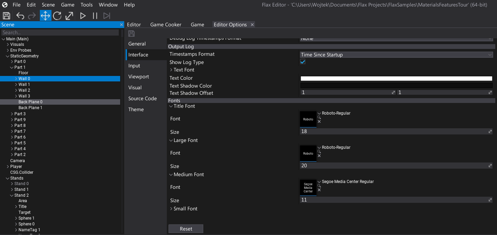
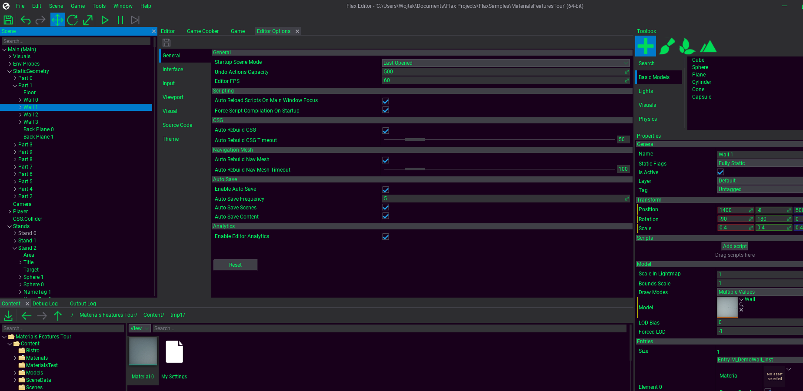

# Editor Style

Flax Editor supports editing the default UI style, colors and font via editor options. To customize the look open main menu **Tools -> Options**.

## Fonts

Open **Interface** tab and in the section **Fonts** you can adjust the font assets and font sizes used for Editor UI. You can also adjust the visuals for a particular parts of the editor (eg. Debug Log, Output Log).
To see changes please restart editor.

## Theme

Open **Theme** tab and under *Styles* subgroup add new item. Thne double click on the label and rename it from *Key* to you name. Then save asset click on the theme preview to edit it.

To preview the changes hit **Ok**, set **Selected Style** to you new entry, **save** the asset and **restart the editor**.

You can restore the default theme by setting *Default* option on *Selected Style*.
