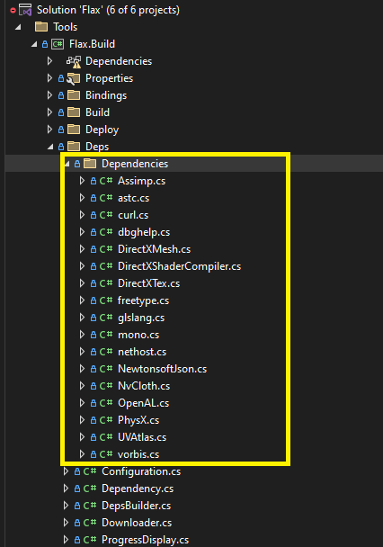

# Build Tool Guide

## Deps



`Flax.Build` handles 3rd Party dependencies downloading, updating and building for all supported platforms. Each package defines the custom logic to download itself (eg. via `git clone` or `zip` decompress). Then code is compiled for selected set of platforms (eg. via `msbuild` or `cmake`). Finally, output binaries are copied into `Source/Platforms/<platform>/Binaries/ThirdParty/<arch>` folder to be used when compiling the engine.

Example command line to update all dependencies for a platform `Android`:

```
Flax.Build -log -ReBuildDeps -verbose -platform=Android
```

Example command line to update `NewtonsoftJson` dependency for all platforms:

```
Flax.Build -log -ReBuildDeps -verbose -depsToBuild=NewtonsoftJson
```
