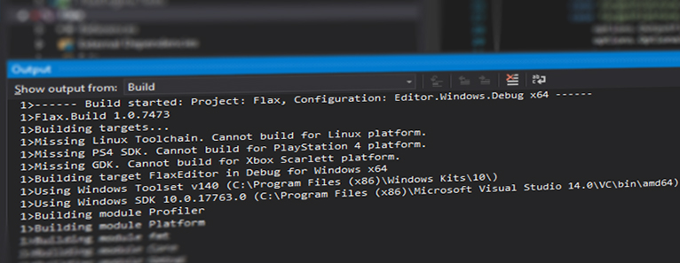

# Flax.Build

**Flax.Build** is an in-build utility which is a complete build system written in C#. It supports:
* compiling and linking of engine, game and tools projects
* downloading and pre-building engine dependencies
* updating 3rd Party libraries
* generating project files
* deploying engine
* generating C# bindings for native code.

Major features:
* high-performance build system
* rapid iterative builds and fast caching
* deep integration with Flax
* extensibility via plugins
* multi-platform support.

This documentation section covers most of the topics related to Flax.Build tool. To learn more please refer to Flax.Build sources located under `Source\Tools\Flax.Build` and/or use `Binaries\Tools\Flax.Build.exe -help` to learn more about usage. Engine repository contains useful scripts that are wrappers against the build tool and automatically compile its sources.

## Build Scripts

The main source of build configuration are **.Build.cs** files located in the project `Source` directory. Written in **C#** scripts can contain targets, modules, SDKs, or other utilities used for building. When generating project scripts files all build scripts are included in **Rules** project which defines the build rules and can be explored with code IDE.

Build scripts are using C# 7.2 with full .Net 4.5 support. Additionally Flax.Build assembly is referenced with many usefull utilities to use during build setup like:
* `CommandLine` attribute for command line parsing
* `Log` utility with info/errors logging capabilities (to log file and to console output)
* `Tokenizer` class for pasing code as tokens
* `Utilities` class with many usefull tools (eg. `WriteFileIfChanged`, `ReplaceInFiles`, `Run`, `GetFileSize`..)
* `Sdk` searching and caching tools (used for ex. `PS4Sdk`, `GDK`, `VulkanSdk`)
* `VCEnvironment` tool that can invoke *MSBuild* tool (works on Windows and Linux).

Using build scripts you can automate many processes related to game/engine/plugin development.

## Targets and Modules

Build **Target** is a script that combines modules to produce a final executable file or composite library. Build **Module** is a script that can be compiled from source and used by other modules and targets. Targets in general define the global build environment (eg. global definitions) and include modules into the binary build. Modules are chunks of code compiled into binaries linked later into a target output binary (eg. game executable file). Modules can have references between each other for example if a game script wants to create GPU Texture resource, the game module needs to reference the Graphics module that implements a GPU texture.

Using modules can greatly improve code readability, allow to split huge codebase into more independent chunks, and they help to organize the structure of the project sources. Modules can be referenced in `Setup` method which means they can have conditional references (eg. Profiler module is not included in Release builds).

Modules and targets are identified by name of C# class which must be unique.

## Building Binaries

Flax.Build uses game project to pick a target for a build (eg. `EditorTarget` property from `.flaxproj` file is used to pick a target for editor). Then the given target `Modules` list is used to collect all modules for building. Depending on the `LinkType` of the target all modules can be merged into a single binary (`Monolithic` build) or every binary module outputs a single binary (`Modular` build).

Modules are collected using `PublicDependencies` and `PrivateDependencies` lists that define direct referenced from the given module.

To modify the build options override `void Setup(BuildOptions options)` method. It contains many build properties that can be adjusted or used in a build script:

| **Property** | **Description** |
|--------|--------|
| *Target* | The target that builds this module. |
| *Platform* | The build platform. |
| *Toolchain* | The build platform toolchain. |
| *Configuration* | The build configuration. |
| *CompileEnv* | The module compilation environment. |
| *LinkEnv* | The module linking environment. |
| *SourcePaths* | The source file directories. By default it contains the directory that contains this module file. |
| *SourceFiles* | The source files to include in module build. |
| *PublicDependencies* | The collection of the modules that are required by this module (for linking). Inherited by the modules that include it. |
| *PrivateDependencies* | The collection of the modules that are required by this module (for linking). |
| *PublicDefinitions* | The collection of defines with preprocessing symbol for a source files of this module. Inherited by the modules that include it. |
| *PrivateDefinitions* | The collection of defines with preprocessing symbol for a source files of this module. |
| *PublicIncludePaths* | The collection of additional include paths for a source files of this module. Inherited by the modules that include it. |
| *PrivateIncludePaths* | The collection of additional include paths for a source files of this module. |
| *DependencyFiles* | The dependency files to include with output (additional debug files, dynamic libraries, etc.). |
| *OptionalDependencyFiles* | The optional dependency files to include with output (additional debug files, dynamic libraries, etc.). |
| *DelayLoadDLLs* | The list of libraries for delay-load (typically external and third-party plugins). |
| *OutputFiles* | The build output files (binaries, object files and static or dynamic libraries). |
| *IntermediateFolder* | The intermediate build artifacts folder directory. |
| *OutputFolder* | The output build artifacts folder directory. |
| *WorkingDirectory* | The build commands working folder directory. |
| *HotReloadPostfix* | The hot reload postfix added to the output binaries. |
| *ScriptingAPI* | The scripting API building options. Contains additional C# defines, system references, and file references to be used when building C# bindings library (.Net Module). |

Flax.Build generates `<target_name>.Build.json` file with build output artifacts description and binary modules metadata used by the engine to load C#/C++ scripting modules. This file is stored in build output directory.

## API Bindings Generation

Flax.Build contains an automatic utility for parsing C++ header files and generates the C# API for the scripting types. This includes classes, structures, enums, functions, etc.

For modules that have assigned `BinaryModuleName` property, then defines the name of the binary module they should be included in, they build tool generates and compiles C# API. The bindings blue code is automatically generated and contains 2 parts:
* C++ glue code - stored in *<module_name>.Gen.cpp* in module build intermediate folder and compiled with module sources
* C# API - stored in *<file>.Gen.cs* files side-by-side with the source header that defines the API types.

To learn more about using C++ API in C# see the related documentation [here](api-tags.md) (about **API_** tags).

Flax.Build supports also virtual table slots overriding for virtual methods of the scripts types and generates wrapper for invoking that method overridden in C# code. This allows inheriting C++ types and override methods in C# and still use the same objects in code.

## Project Files Generation

Flax.Build uses targets and modules to generate the scripting project files for editing the sources in the code editor environment such as Visual Studio or Visual Studio Code. For Visual Studio the project files are stored in `Cache/Projects` folder. Generated solution organizes the referenced projects in sub-folders and includes both C++ and C# scripts projects.

Additionally, all build scripts are included in **BuildScripts** C# project which defines the build rules and can be explored with code IDE to easily edit them with contextual tooltips and code completion tools.

## Platforms Support

Flax.Build is a **multiplatform** utility thas has been battle-tested on Windows and Linux to build engine and games to the different target platforms including Windows, PS4, XboxOne, XboxScarlett, Linux, UWP. Each target platform implementation is stored in a separate directory under `Source\Tools\Flax.Build\Platforms` and contain **Platform** implementation and **Toolchain** implementation. Different platforms can use external SDKs, toolsets, or custom compilers to build code for a runtime.

Also, engine dependency packages contain automatic build scripts to prepare pre-build deps for development. When adding new platform support many deps packages have to be ported too. The related code can be found in `Source\Tools\Flax.Build\Deps\Dependencies` folder.

## Extensibility

Flax.Build tool is written in modern C# and supports extending with custom **plugins** inside build scripts. To learn how to use them see related documentation [here](plugins.md).
