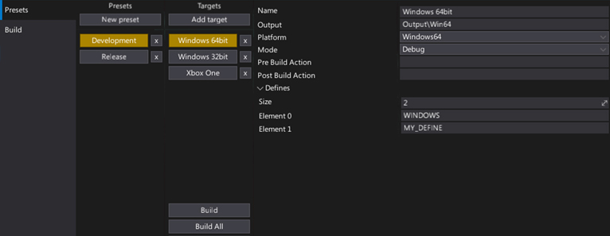
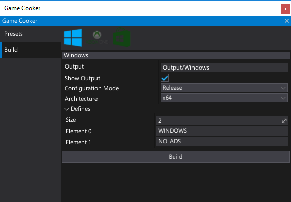
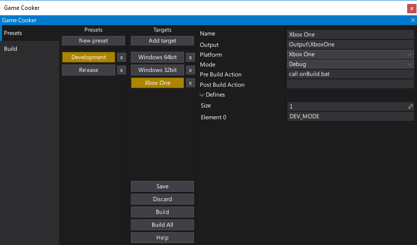
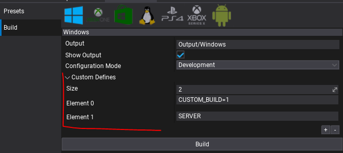

# Game Cooker



**Game Cooker** is a tool used for building the game.
It compiles the game scripts and processes all used assets to output a standalone game files for the destination platform.
Game Cooker is highly configurable and can be used right inside the editor, via dedicated C# API ([GameCooker](https://docs.flaxengine.com/api/FlaxEditor.GameCooker.html) service), or using the [command line arguments](../advanced/command-line-access.md).

Using game cooker can be described as the last step of game creation process where ready to deploy game can be cooked for many different platforms.

> [!NOTE]
> Game Cooker window can be opened by selecting the main menu option **Window -> Game Cooker** or **Tools -> Game Cooker**.

## Features

Game Cooker features:
* Easy to use
* Highly configurable
* Command line access ([more info](../advanced/command-line-access.md))
* Custom build presets
* Incremental building
* Shaders/materials precompiling
* Content encryption/compression
* Asset references auto searching
* Multi-platform support
* C# Editor API access

## Build



Game Cooker window is divided into two separate modes. The second one is a **Build** tab.
It contains easy to use GUI for a quick game building.
Using it is highly reccomened to perform fast test builds or if you don't need any advanced configuration.

To use it simply select a target platform icon and press the Build button.
Of course, there are some basic settings like configuration mode (release/debug) or the output directory but overall it’s meant to be used for a fast game cooking.

> [!TIP]
> Game Cooker has a local cache separate for every platform so one engine instance can build all platforms without long switching time.

Finally, when you start cooking a game in the editor it’s done on a separate thread so all editor logic including play in-editor mode is fully supported.
Only editing asset is not allowed but a user can still edit a scene or test scripts while the game is being built.

## Presets



The biggest strength of the Game Cooker are **Presets**.
Those Presets are stored in the [Build Settings](../game-settings/build-settings.md) asset. Editor plugins can access it from C# API. Furthermore, an asset is stored in pure JSON format so any version control systems may be used to work on Flax games in a team.

Each preset is named (e.g. Development, Release) and contains a group of build targets.
Each target is also named and has custom configuration settings (e.g. pre/post build actions and script defines).
By selecting the buttons you can choose a target to build it or even build all targets from the selected preset at once.
It's very easy to use and provides enough functionality for bigger projects where devs need to target many different platforms and support various build modes: test builds, profiling builds and shipping builds.
All those things can be made with Flax presets using Game Cooker window and Build Settings editor.

## Custom Defines



When working with more complex game build setups you can use **Custom Defines** feature which allows to inject custom symbols into build system and access them to change the scripts building rules. For instance, you can use it to switch between game client or game server builds.

Game Cooker Preset contains a list of configurable `Custom Defines` (works the same for Game Cooker Build panel Custom Defines). They are injected into `Flax.Build` command when compiling game scripts. Those can be accessed from `.Build.cs` scripts using `Configuration.CustomDefines`.

#### Injecting custom defines into C# scripts compilation

```cs
/// <inheritdoc />
public override void Setup(BuildOptions options)
{
    base.Setup(options);

    ...

    options.ScriptingAPI.Defines.AddRange(Configuration.CustomDefines);
}
```

#### Injecting custom defines into C++ scripts compilation

```cs
/// <inheritdoc />
public override void Setup(BuildOptions options)
{
    base.Setup(options);

    ...

    options.PrivateDefinitions.AddRange(Configuration.CustomDefines);
}
```

#### Conditional game modules compilation based on custom defines

```cs
/// <inheritdoc />
public override void Setup(BuildOptions options)
{
    base.Setup(options);

    ...

    if (Configuration.CustomDefines.Contains("SERVER"))
        options.PrivateDependencies.Add("GameServerModule");
    else
        options.PrivateDependencies.Add("GameClientModule");
}
```
