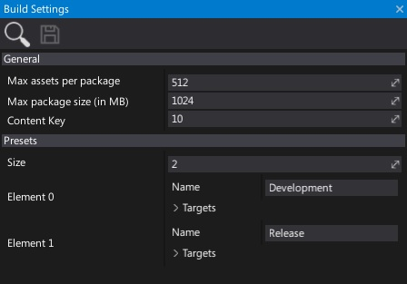

# Build Settings

Build settings asset specifies the Game Cooker options and contains set of game building presets.
For editing and using presets see [Game Cooker window](../game-cooker.md) as it has a better interface to do it.

## Properties

| Property | Description |
|--------|--------|
| **Max assets per package** | The maximum amount of assets to include into a single assets package. Assets will be spli into several packages if need to. |
| **Max package size (in MB)** | The maximum size of the single assets package (in megabytes). Assets will be spli into several packages if need to. |
| **Content Key** | The game content cooking Keys. Use the same value for a game and DLC packages to support loading them by the builded game. Use 0 to randomize it during building. |
| **Presets** | The build [presets](https://docs.flaxengine.com/api/FlaxEditor.Content.Settings.BuildPreset.html). |

