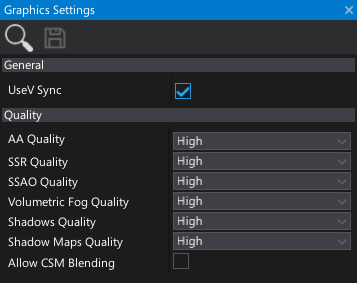

# Graphics Settings

The graphics settings asset specifies the initial rendering quality and other graphics-related options.
You can change most of these values at runtime using the [GraphicsQuality](https://docs.flaxengine.com/api/FlaxEngine.GraphicsQuality.html) service or by using the dedicated window to edit the graphics quality in the editor (select option from *main menu* **Window -> Graphics Quality**).

## Properties

| Property | Description |
|--------|--------|
| **Use V-Sync**  | Enables rendering synchronization with the refresh rate of the display device to avoid "tearing" artifacts. |
|||
| **AA Quality** | Anti Aliasing quality setting. |
| **SSR Quality** | Screen Space Reflections quality. |
| **SSAO Quality** | Screen Space Ambient Occlusion quality setting. |
| **Volumetric Fog Quality** | Volumetric Fog quality setting. |
| **Shadows Quality** | The shadows quality. |
| **Shadow Maps Quality** | The shadow maps quality (textures resolution). |
| **Allow CSM Blending** | If checked, enabled cascades splits blending for directional light shadows. Disable to reduce performance impact for dynamic sun shadows. |
| **Default Probe Resolution** | Default probes cubemap resolution (use for Environment Probes, can be overriden per-actor). Recommended is default `128x128`. For mobile platforms try using a lower resolution to get more performance. |
| **Uee HDR Probes** | If checked, Environment Probes will use HDR texture format. Improves quality in very bright scenes at cost of higher memory usage. |
|||
| **Enable Global SDF** | If checked, enables Global SDF rendering. This can be used in materials, shaders, and particles. |
| **Global SDF Quality** | The Global SDF quality. Controls the volume texture resolution and amount of cascades to use. |
| **Generate SDF On Model Import** | If checked, the `Generate SDF` option will be checked on model import options by default. Use it if your project uses Global SDF (eg. for Global Illumination or particles). |
|||
| **GI Quality** | The Global Illumination quality. Controls the quality of the GI effect. |
| **GI Probes Spacing** | The Global Illumination probes spacing distance (in world units). Defines the quality of the GI resolution. Adjust to 200-500 to improve performance and lower frequency GI data. |
| **Global Surface Atlas Resolution** | The Global Surface Atlas resolution. Adjust it if atlas `flickers` due to overflow (eg. to 4096). |
|||
| **Post Process Settings** | The default Post Process settings. Can be overriden by PostFxVolume on a level locally, per camera or for a whole map. |
