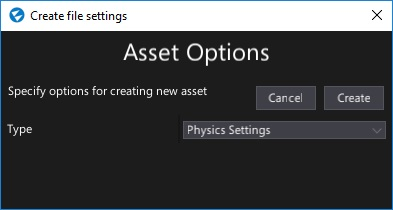
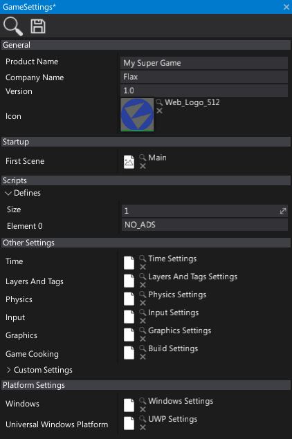

# Game Settings

**Game Settings** infrastructure is used to prepare the Flax options for the builded game.
By using game settings you can set the initial game scene, link your plugin runtime options or more.
This section covers the main concept of game settings and documents the related asset types.

## Root asset

In order to provide more universal design and unify the [projects structure](../../get-started/project-structure.md) game settings asset is **always located** in `Content/GameSettings.json`. This file is in json format and contains the basic game description (product name, company, etc.) and references other assets (time settings, layers and tags, etc.).
Example game settings file can be found [here](https://github.com/FlaxEngine/FlaxSamples/blob/master/BasicTemplate/Content/GameSettings.json). By default all Flax samples and templates contain a proper game settings to use.

## Creating settings

You can use the *Content* window to create new settings. Simply right-click in the Content folder and select option **New -> Settings**, specify its name and press *Enter*. Then select the new asset type. Game settings asset or any other settings asset is normal Json resource so you can rename/move/edit them like other asset types. It's highly recommended to use a [version control](../../get-started/version-control.md) system for settings as they are text files and should be versioned when working in a team.

## Properties

| Property | Description |
|--------|--------|
| **Product Name** | The name of your game. |
| **Company Name** | The name of your company or organization. |
| **Version** | The product version. Separated with dots: *major.minor.build.revision*. |
| **Icon** | The default application icon. Can be overriden per platform. |
| **FirstScene** | Reference to the first scene to load on a game startup. |
| **Defines** | The custom macros used using scripts compilation. |
| **Time** | Reference to [Time Settings](time-settings.md) asset. Contains initial time manager options. |
| **Audio** | Reference to [Audio Settings](../../audio/audio-settings.md) asset. Contains initial audio playback engine options. |
| **Layers And Tags** | Reference to [Layers And Tags Settings](layers-and-tags-settings.md) asset. Contains actors tags and layer names used in your game. |
| **Physics** | Reference to [Physics Settings](../../physics/physics-settings.md) asset. Contains physics simulation options. |
| **Input** | Reference to [Input Settings](../../input/input-settings.md) asset. Contains initial virtual input layout. |
| **Graphics** | Reference to [Graphics Settings](graphics-settings.md) asset. Contains initial rendering options. |
| **Game Cooking** | Reference to [Build Settings](build-settings.md) asset. Contains Game Cooker profiles and additional options used during games building. |
| **Custom Settings** | Collection of custom json assets used by the game and plugins. |
| **Windows** | Reference to [Windows Settings](../../platforms/windows.md) asset. Contains options used when building game for Windows. |
| **Universal Windows Platform** | Reference to [Universal Windows Platform Settings](../../platforms/uwp.md) asset. Contains options used when building game for Xbox One and Windows Store |
