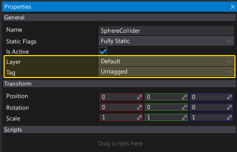

# Layers And Tags Settings

Every actor can have a game tag and be assigned to one of the layers.
Using tags and layers helps with identifying and filtering objects.
For example, a player actor can have a `Player` tag and when box trigger attached to a car detects it within a range it can allow the player to enter the car.

Flax allows defining unlimited amount of tags and up to 32 different layers.

Layers are also used by the physics engine to filter objects collisions and by rendering system to draw objects using a layer mask filter.

## Set actor tag/layer

You can assign a game tag and layer to every actor.
It can be done in editor (by using *Properties* window) or at runtime using [Actor.Layer](https://docs.flaxengine.com/api/FlaxEngine.Actor.html#FlaxEngine_Actor_Layer) and [Actor.Tag](https://docs.flaxengine.com/api/FlaxEngine.Actor.html#FlaxEngine_Actor_Tag) properties.

## Properties

| Property | Description |
|--------|--------|
| **Tags** | Collection of game tags. |
| **Layers** | Array of 32 layers. |

> [!NOTE]
> If you edit tags/layers names, there will need to restart the editor to see the changes.

