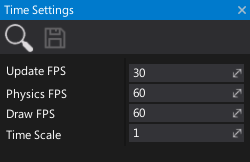

# Time Settings

Time settings asset describes the initial values for the time manager.
By adjusting those values you can adapt a proper FPS or physics simulation quality for your game.
You can access and edit this setting using [Time](https://docs.flaxengine.com/api/FlaxEngine.Time.html) service.

## Properties

| Property | Description |
|--------|--------|
| **Update FPS** | The target amount of the game logic updates per second (script updates frequency). |
| **Physics FPS** | The target amount of the physics simulation updates per second (also fixed updates frequency). |
| **Draw FPS** | The target amount of the frames rendered per second (actual game FPS). |
| **Time Scale** | The game time scale factor. Default is 1. |
| **Max Update Delta Time** | The maximum allowed delta time (in seconds) for the game logic update step. |
