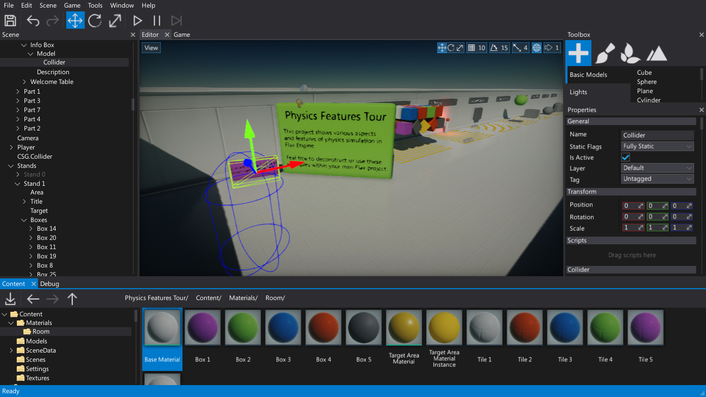
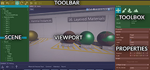
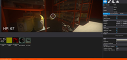
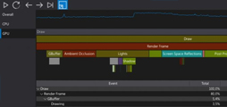
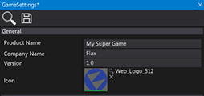
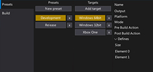
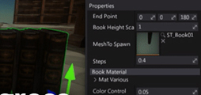

# Flax Editor Documentation

**Flax Editor** is an all-in-one application used to develop games with Flax Engine.
This documentation section covers the most important topics and describes how to use all editor tools.
Follow those instructions to robust your game development!

## Topics

<h3><a href="interface.md">Interface</a></h3>

Learn about Flax Editor interface and using dockable windows.

<h3><a href="play-in-editor.md">Play in-editor</a></h3>

Test your game right in the editor.

<h3><a href="windows/index.md">Windows</a></h3>

See the detailed documentation about editor windows.

<h3><a href="game-settings/index.md">Game Settings</a></h3>

Learn about your game configuration and build settings.

<h3><a href="game-cooker/index.md">Game Cooker</a></h3>

Cook your game files and produce ready to deploy files.

<h3><a href="advanced/index.md">Advanced</a></h3>

Learn some advanced stuff about using Flax Editor.

